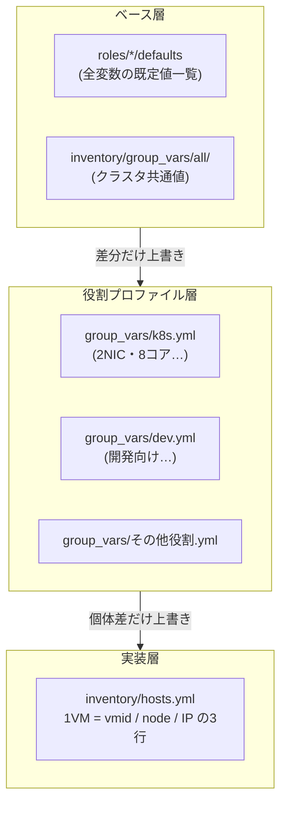
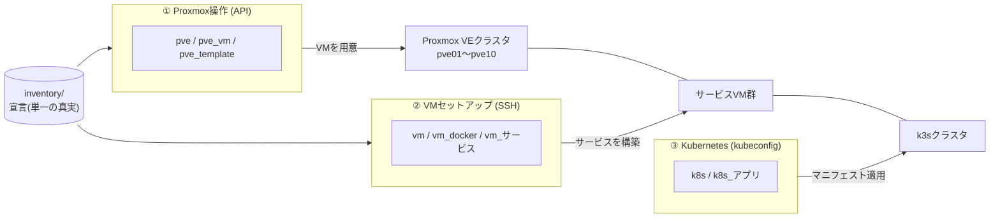
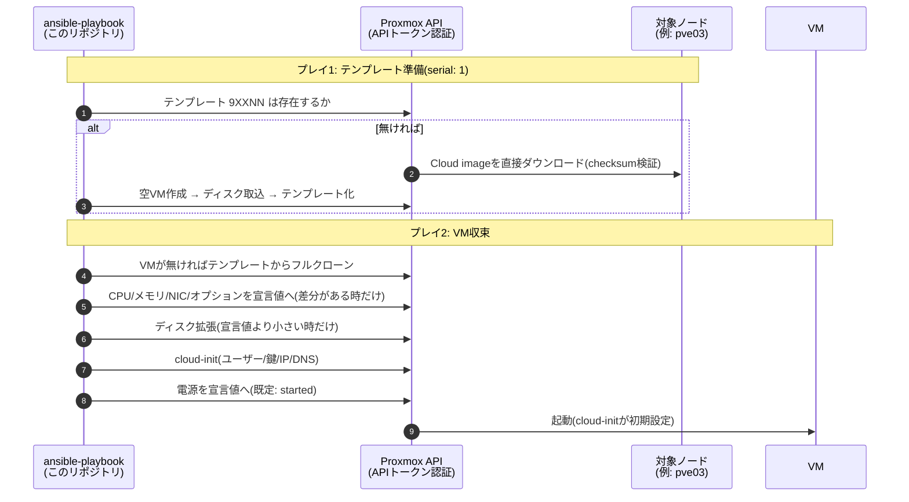

# infrastructure

自宅ラボのインフラを **Ansible中心・宣言的** に管理するリポジトリ。
Proxmox VEクラスタ上のVM構築から、VM内のサービスセットアップ、Kubernetesマニフェストの適用までを、ひとつの体系で扱う。

対象となるインフラそのものの構成(ネットワーク図・サービス公開経路)は **[infrastructure.md](infrastructure.md)** にまとめている。

## 設計思想

**「ベース → 役割ごとの最適化 → 実装」の3層**で全ドメインを統一する。
変数のマージ処理は書かず、Ansible標準の変数優先順位に任せる。優先度は **読みやすさ > 共通化**。



## 3つのドメイン

**命名規則はひとつだけ**: `<ドメイン>` = ベースロール、`<ドメイン>_<名前>` = そのドメインの部品・実装。

| ドメイン | ベース | 実装 | playbook |
| --- | --- | --- | --- |
| ① Proxmox操作 | `roles/pve` `pve_vm` `pve_template` | インベントリの宣言そのもの | `playbooks/pve/` |
| ② VMセットアップ | `roles/vm` `vm_docker` | `vm_authentik` `vm_wg_easy` `vm_k3s` … | `playbooks/vm/` |
| ③ Kubernetes | `roles/k8s` | `k8s_external` `k8s_portainer` `k8s_guacamole` … | `playbooks/k8s/` |



## 使いかた

Vaultパスワードは環境変数 `ANSIBLE_VAULT_PASSWORD_FILE`(Dev Containerが設定)で自動供給される。すべてリポジトリルートで実行する。

```sh
# VMを宣言どおりに収束(テンプレート準備→クローン→設定→cloud-init→起動 まで全部)
ansible-playbook playbooks/pve/provision.yml -l k8s          # 役割ごと
ansible-playbook playbooks/pve/provision.yml -l k3s-worker03 # 1台だけ

# 電源(冪等)
ansible-playbook playbooks/pve/power.yml -l k8s -e state=stopped

# 削除(confirm二重指定が必須。停止中のVM/テンプレートのみ)
ansible-playbook playbooks/pve/destroy.yml -e vmid=991 -e confirm=991

# テンプレートだけ単体で用意する場合
ansible-playbook playbooks/pve/template.yml -e os=debian -e version=13 -e target_node=pve01

# サービスVMの一気通貫構築(①provision + ②SSHセットアップ)
ansible-playbook playbooks/vm/authentik.yml

# Kubernetesアプリの収束(Secretも含めて全部。収束済みなら changed=0)
ansible-playbook playbooks/k8s/deploy.yml --check          # 差分の有無を確認
ansible-playbook playbooks/k8s/deploy.yml                  # 全アプリ
ansible-playbook playbooks/k8s/deploy.yml -e app=portainer # 1アプリだけ

# インベントリに書かずに1台だけ作る(検証VM。詳細は docs/pve/adhoc.md)
ansible-playbook playbooks/vm/dev/setup.yml \
  -e target=tmp01 -e profile=dev -e vmid=799 -e node=pve07 -e ip=172.16.11.99
```

### provision が収束させる流れ



- 全タスクが**冪等**: 収束済みなら `changed=0`
- テンプレートは **(OS, ノード)ごと** に VMID `9XXNN`(XX=OSカタログ番号, NN=ノード番号)で管理する。全ストレージがノードローカルであり、クロスノードのクローンができないため
- NICの更新時は既存MACアドレスを引き継ぐ(意図しないMAC再生成を防ぐ)

## ディレクトリ構成

```
.
├── ansible.cfg          # リポジトリルート = Ansibleプロジェクトルート
├── infrastructure.md    # ネットワーク構成とサービス公開経路の図(インフラの全体像)
├── inventory/           # ★宣言(単一の真実)
│   ├── hosts.yml        #   全VM: グループ=役割、1VM=3〜5行
│   └── group_vars/      #   all/=ベース、<役割>.yml=プロファイル
├── playbooks/
│   ├── pve/             # ① provision / power / destroy / template(+ adhoc=一時ホスト登録)
│   ├── vm/              # ② サービスVMの一気通貫構築(dev/ は setup / password に分割)
│   ├── k8s/             # ③ deploy(全アプリ or -e app=X)
│   └── utils/           # APIを叩く単発ツール(awx/=AWX設定収束・Job操作, authentik/=ユーザー管理)
├── roles/               # ドメイン別: pve* / vm* / k8s*
├── vault/               # Ansible Vault(全ファイル暗号化済み)
├── collections/         # requirements.yml → ee/ へのsymlink(AWX互換の標準位置)
├── ee/                  # AWXカスタム実行環境(ansible-builder)。コレクション定義の実体
└── docs/                # playbooks/と同構成のドキュメント(1 playbook=1ページ + awx/ + utils/)
```

## 秘匿情報の扱い

- **Ansible側**: `vault/*.yml` は全て `ansible-vault` で暗号化(同一パスワード)。平文の秘密情報・実IP以外のトークン類はコミットしない
- **Kubernetes側**: アプリのSecretも `vault/k8s_secrets.yml`(暗号化済み)に一元化。`deploy.yml` が各アプリのSecretを `no_log` で適用する(--diffでも中身は出ない)
- PVE APIトークンは `vault/proxmox_api.yml`(暗号化済み)の4変数。各playbookが `module_defaults` で全モジュールへ一括供給する

## ドキュメント

| ドキュメント | 内容 |
| --- | --- |
| [infrastructure.md](infrastructure.md) | **インフラの全体像**: 物理NIC〜vmbrのネットワーク構成図と、サービス公開経路(Traefik / Cloudflare Tunnel / WireGuard) |
| [docs/README.md](docs/README.md) | **ドキュメントの入口**(playbooks/と同じ構成で1 playbook=1ページ。実行例・変数一覧・AWX設定はここから辿る) |
| [docs/pve/](docs/pve/README.md) | ① Proxmox操作ドメイン(provision/power/destroy/template/adhoc) |
| [docs/vm/](docs/vm/README.md) | ② VMセットアップドメイン(サービス別playbook・k3sクラスタ構築・鍵を本文で渡す仕組み) |
| [docs/k8s/](docs/k8s/README.md) | ③ Kubernetesドメイン(deploy・アプリ追加・Secret・チャート管理) |
| [docs/awx/](docs/awx/README.md) | **AWX**(Web UIからの実行前提とSurvey設計。設定の収束は docs/utils/awx/configure.md) |
| [docs/utils/](docs/utils/README.md) | **単発ツール**(AWXの設定収束・Job起動・状況取得・Inventory同期、Authentikユーザー/グループ管理) |
| [.devcontainer/README.md](.devcontainer/README.md) | Dev Containerのセットアップ注意点 |
