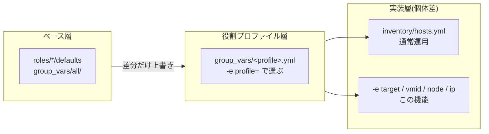

# インベントリ外のVMを `-e` だけで構築する

`inventory/hosts.yml` に宣言していないVMを、コマンドラインの `-e` だけで構築するための仕組み。
使い捨ての検証VM、宣言を書く前の新サービスの試作、同じ役割の一時的な増設に使う。

> **恒久的に運用するVMは `inventory/hosts.yml` に宣言する。** この機能は宣言を置き換えるものではなく、宣言を書く前の実験用。気に入ったら[インベントリへ移す](#気に入ったらインベントリへ移す)。

## 仕組み

`-e profile=<役割グループ>` を指定したときだけ、[playbooks/pve/adhoc.yml](../playbooks/pve/adhoc.yml) が実行時にホストを1台つくり、そのグループへ入れる。
以降は**インベントリに書いたホストとまったく同じ**に扱われるため、3層の変数解決もそのまま効く。



`-e profile=` が無ければ adhoc.yml は何もしないため、**通常のインベントリ運用には一切影響しない**。

## 指定する変数

| 変数 | 必須 | 意味 | 例 |
| --- | :-: | --- | --- |
| `target` | ✔ | 新しいホスト名。そのままPVE上のVM名になる | `tmp01` |
| `profile` | ✔ | 継承する役割グループ。プロファイルを継承しないなら `lab` | `dev` |
| `vmid` | ✔ | VMID | `799` |
| `node` | ✔ | 配置するPVEノード | `pve07` |
| `ip` | ✔ | 1枚目NICのIP(= `ansible_host`) | `172.16.11.99` |
| `ip2` | | 2枚目NICのIP(= `cluster_ip`)。プレフィックス付き。NIC2枚の役割のみ | `10.10.20.19/24` |

**これ以外は普段どおりの変数名でよい**。上書きしたい値を `-e pve_vm_memory=4096` のように足すだけで、優先順位はAnsible標準のまま(`-e` が最優先)。指定できる変数の一覧は [docs/pve.md](pve.md#vmの宣言のしかた) と `roles/*/defaults/main.yml` が正。

> IPだけ `-e ansible_host=` ではなく `-e ip=` を使う。`-e` は**全ホストへ最優先で効く**ため、`ansible_host` を直接渡すと `hostvars[別ホスト].ansible_host` を参照している箇所(`group_vars/k8s.yml` の `kubernetes_server_ip` など)まで書き換わってしまう。adhoc.ymlが `ip` を新ホストのホスト変数として登録することで、他ホストを汚さずに済ませている。

## 使いかた

### ① VMだけ作る

```sh
# devプロファイルを継承(CPU8/メモリ8G/ディスク256G/ciuser=dev は group_vars/dev.yml から)
ansible-playbook playbooks/pve/provision.yml \
  -e target=tmp01 -e profile=dev -e vmid=799 -e node=pve07 -e ip=172.16.11.99

# プロファイルを継承せず(profile=lab)、必要な値だけ自分で決める
ansible-playbook playbooks/pve/provision.yml \
  -e target=tmp02 -e profile=lab -e vmid=798 -e node=pve06 -e ip=172.16.11.98 \
  -e pve_vm_cores=4 -e pve_vm_memory=4096 -e pve_vm_disk_size=40 \
  -e pve_os=ubuntu -e pve_os_version=24.04
```

### ② サービスまで一気通貫

```sh
# 2台目のTechnitium DNSを検証用に立てる(サービス設定も group_vars/technitium.yml から継承)
ansible-playbook playbooks/vm/technitium.yml \
  -e target=technitium-dns02 -e profile=technitium \
  -e vmid=605 -e node=pve06 -e ip=172.16.11.31

# k3sワーカーを1台だけ追加する(参加先のコントロールプレーンは宣言から自動解決される)
ansible-playbook playbooks/vm/k3s.yml \
  -e target=k3s-worker05 -e profile=k8s \
  -e vmid=801 -e node=pve08 -e ip=172.16.12.19 -e ip2=10.10.20.19/24

# サービス設定を-eで変えて立てる(group_vars/<役割>.yml の値を個体だけ上書き)
ansible-playbook playbooks/vm/wg-easy.yml \
  -e target=wg-easy02 -e profile=wg_easy \
  -e vmid=506 -e node=pve05 -e ip=172.16.11.32 \
  -e wg_easy_init_host=vpn2.cc-chacchan.com -e wg_easy_wg_port=51822
```

### ③ 電源と削除

```sh
# 停止(削除するには先に停止が必要)
ansible-playbook playbooks/pve/power.yml -e state=stopped \
  -e target=tmp01 -e profile=dev -e vmid=799 -e node=pve07 -e ip=172.16.11.99

# 削除(VMIDだけで動くため profile などは不要)
ansible-playbook playbooks/pve/destroy.yml -e vmid=799 -e confirm=799
```

## 気に入ったらインベントリへ移す

`-e` の指定が、そのまま `inventory/hosts.yml` の1行になる。移したあとは `-e` なしの通常運用に戻る。

| 実行時の `-e` | インベントリでの書きかた |
| --- | --- |
| `-e target=tmp01` | ホスト名 `tmp01:` |
| `-e profile=dev` | `dev:` グループの下に置く |
| `-e vmid=799` | `vmid: 799` |
| `-e node=pve07` | `node: pve07` |
| `-e ip=172.16.11.99` | `ansible_host: 172.16.11.99` |
| `-e ip2=10.10.20.19/24` | `cluster_ip: 10.10.20.19/24` |
| `-e pve_vm_memory=4096` | `pve_vm_memory: 4096` |

## 制約と注意

- **`-l`(`--limit`)と併用しない**。ホストを登録するlocalhostのプレイまで除外され、対象が0台になる。絞り込みは `-e target=` が行う
- 1回の実行で作れるのは**1台**
- 一時ホストはその実行かぎり。**作ったVMは宣言に残らない**ため、以降 `provision.yml`(lab全体)の収束対象には入らない。使い続けるならインベントリへ移す
- IPは `-e ip=` / `-e ip2=` で渡す。`-e ansible_host=` や `-e cluster_ip=` を直接指定すると全ホストに効いてしまう
- `profile=lab`(継承なし)でSSHまで進む場合は、cloud-initが作るユーザーと鍵を自分で渡す:
  `-e pve_ssh_user=<ユーザー名> -e pve_ssh_pubkey_file=~/.ssh/<公開鍵> -e pve_ssh_prikey=~/.ssh/<秘密鍵>`
- `profile=lab` のデフォルトゲートウェイは `group_vars/all/pve.yml` の `172.16.11.1`。別セグメント(vmbr2など)に置くなら `-e pve_ipv4_gw=` と `-e '{"pve_vm_nets":[{"bridge":"vmbr2"}]}'` も指定する
- `--list-hosts` では対象を確認できない(ホストの登録は実行時に行われるため)

### 実行前に止まるもの

指定ミスは adhoc.yml が **Proxmoxに触る前** に検出して停止する。

| 止まる条件 | 例 |
| --- | --- |
| `target` が既存のホスト名・グループ名 | `-e target=yuya-dev` / `-e target=dev` |
| `target` にインベントリパターンが混ざっている | `-e target=all:!dev` |
| `profile` が存在しない役割グループ | `-e profile=devv` |
| `profile` がplaybookの前提と違う | `playbooks/vm/dev.yml -e profile=k8s` |
| `vmid` / `node` / `ip` の書式ミス・指定漏れ | `-e ip=172.16.11` |

VMIDと実機の突き合わせは、この後 `roles/pve` の検索が行う(宣言と違う名前・ノードのVMを掴んだら停止する)。
