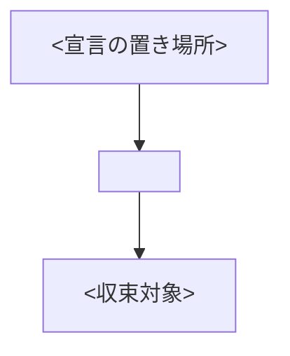

# <ドメイン名>ドメイン(<接頭辞>)

<!--
docs/ 配下の書きかたの標準。各ディレクトリの default.md がそのディレクトリ用の型を持つ。
- ドメインの入口ページは README.md(このテンプレート)、個別ページは1ページ=1playbook
- 見出しは各テンプレートの順序・名称を変えない。該当しない節は丸ごと削除する
- 文章もコメントも「説明」だけを書く。判断の経緯・変更の過程は書かない
- 既定値の正はコード(roles/*/defaults、inventory/group_vars)。ドキュメントへ書き写さない
- 図はmermaid、コマンドは ```sh、マニフェストや変数は ```yaml
- 参照はリポジトリ相対のリンクにする
-->

<このドメインが何を担当するかを1〜3文。>

## 全体像



## playbook一覧(1ページ=1playbook)

| playbook | ドキュメント | 何をするか | 使うvault |
| --- | --- | --- | --- |
| [<名前>.yml](../../playbooks/<ドメイン>/<名前>.yml) | [<名前>.md](<名前>.md) | <説明> | <ファイル名 or −> |

## 共通の動作

<このドメインの全playbookに共通する流れ。番号付きリストで書く。>

## 共通の変数

| 変数 | 型 | 必須 | 既定値 | 説明 |
| --- | --- | :-: | --- | --- |
| `<変数>` | <型> | | `<既定値>` | <説明> |

## 設計メモ(なぜこうなっているか)

- **<設計>**: <理由>

## トラブルシューティング(ドメイン共通)

| 症状 | 原因と対処 |
| --- | --- |
| <症状> | <対処> |
