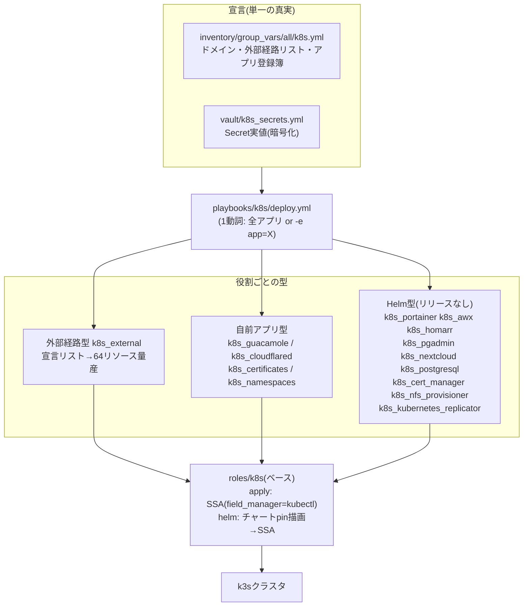
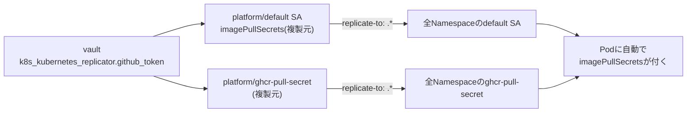

# ③ Kubernetesドメイン(k8s)

k3sクラスタ上の全アプリを **Ansibleロールで宣言的に収束** させるドメイン。マニフェスト・Helm values・SecretのすべてがこのリポジトリにあるためGitが単一の真実であり、クラスタ全損からでも再構築できる(kustomizeは2026-08のPhase Mで解体済み)。

playbookは [deploy.yml](../../playbooks/k8s/deploy.yml) の1本のみ → 使いかたは **[deploy.md](deploy.md)**。

## 全体像



## クラスタの基本情報

| 項目 | 値 |
| --- | --- |
| ディストリビューション | k3s(Traefik v3同梱。kube-systemのTraefikは**管理対象外**) |
| 証明書 | cert-manager + Let's Encrypt(Cloudflare DNS-01)のワイルドカード `cc-chacchan-wildcard-tls` |
| 永続ストレージ | TrueNAS NFS(StorageClass `truenas-nfs`)。既定の`local-path`は永続用途に使わない |
| 外部公開 | Cloudflare Tunnel(`auth`/`api`)。他はLAN内のみ |
| 共有DB | PostgreSQL(StatefulSet)。homarr/awx/pgadmin/nextcloud/guacamoleが共用 |
| プライベートレジストリ | ghcr.io。pull用Secretをkubernetes-replicatorが全Namespaceへ複製 |

## アプリの追加のしかた

### クラスタ外サービスを公開する(外部経路)

`inventory/group_vars/all/k8s.yml` の `k8s_external_routes` にエントリを足すだけ。Service(セレクタなし)+EndpointSlice+Ingress+Middlewareが自動生成される:

```yaml
  - name: myapp
    backend_ip: 172.16.11.99
    scheme: http
    ports: [{name: http, port: 8080}]
    ingresses:
      - name: myapp
        host: myapp.cc-chacchan.com
        port: http
        forwarded_https: true   # X-Forwarded-* を付けるMiddlewareを生成
```

自己署名HTTPSのバックエンドは `scheme: https` + `transport`(insecureSkipVerify)を使う(proxmox/truenasの実例を参照)。

### 自前コンテナのアプリ

`roles/k8s_guacamole` をひな型に `roles/k8s_<アプリ>` を作る: templates/にマニフェスト、tasks/main.ymlは「Secret→本体→Ingress」の順で `roles/k8s` のapplyを呼ぶ。最後に `k8s_apps` へ登録。

### 上流Helmチャートのアプリ

`roles/k8s_portainer` をひな型に: defaults/main.ymlに `<役割>_helm_version`(バージョン固定)と `<役割>_values`(values全文)を置き、tasks/main.ymlで `roles/k8s` のhelmを呼ぶ。**Helmリリースは作らない**(helm template→SSA)。

| チャート | 固定 | 特記 |
| --- | --- | --- |
| jetstack/cert-manager | v1.21.0 | --no-hooks。ns注入禁止(kube-systemにも書く) |
| nfs-subdir-external-provisioner | 4.0.18 | --no-hooks。**ns注入必須**(忘れるとdefaultに落ちる) |
| portainer/portainer | 239.5.0 | --no-hooks |
| awx-operator | 3.2.1 | --include-crds。ns注入必須。AWX本体はOperatorが作る |
| homarr-labs/homarr | 8.26.0 | ns注入必須。OCI版は使わない |
| runix/pgadmin4 | 1.66.0 | --no-hooks |
| groundhog2k/postgres | 1.6.7 | ns注入必須。customScriptsでDB作成 |
| nextcloud/nextcloud | 9.2.5 | ns注入必須。OIDC設定はbefore-startingフック |
| mittwald/kubernetes-replicator | 2.12.4 | ns注入禁止。Secret/ServiceAccountの複製だけ有効化(ClusterRoleの権限もそこまで) |

バージョン更新は defaults の1行を書き換えて `deploy.yml -e app=X --check` → 差分を確認してから適用。

## Secretの扱い

- 実値は `vault/k8s_secrets.yml`(ansible-vault暗号化)の `k8s_secret_<Secret名スネークケース>` 変数。各アプリロールが**先頭で** `no_log` 付き適用する(--check --diffでも中身は出ない)
- 例外: `k8s_kubernetes_replicator.github_token` はSecretの中身をそのまま持つのではなく、生の資格情報(GitHub PAT)。ロール側で `.dockerconfigjson` を組み立てるため命名規則から外れる
- `k8s_backup_*` 変数(awx-admin-password / awx-secret-key / redhat-operators-pull-secret)は**バックアップ専用**。オペレータが生成・管理するためdeployは触らないが、失うと復元不能なので暗号化保管している
- 編集は `ansible-vault edit vault/k8s_secrets.yml`。PostgreSQLパスワードは5アプリのDB接続情報に埋め込まれているため、変える場合は全対応キーを揃えて更新する

## プライベートレジストリ(ghcr.io)

`roles/k8s_kubernetes_replicator` が、ghcr.ioのpull資格情報を**全Namespaceへ自動で配る**。Namespaceを増やしても、Podに `imagePullSecrets` を書いても回らなくてよい。



- **複製元は `platform` の2つだけ**。他Namespaceのものはコントローラが作る複製物で、`kubectl` で直接直しても次の同期で上書きされる
- Pod側の対応は**不要**。`default` ServiceAccountで動くPodには、ServiceAccount admissionが `imagePullSecrets` を注入する(`kubectl run x --image=... --dry-run=server -o yaml` で確認できる)
- **独自ServiceAccountで動くPodは対象外**。上流Helmチャート由来のPod(cert-manager等)がghcr.ioを使う場合は、Pod specかそのServiceAccountに `imagePullSecrets` を明示する
- 対象範囲は `k8s_kubernetes_replicator_target_namespaces`(既定 `.*` = 全Namespace)。`default` SAへの注入をやめるなら `k8s_kubernetes_replicator_inject_default_sa: false`
- トークンを差し替えるときは `ansible-vault edit vault/k8s_secrets.yml` → `deploy.yml -e app=kubernetes_replicator`。複製元の更新が全Namespaceへ伝播する
- **このロールだけSecretを最後に適用する**。起動直後のコントローラはinformerのキャッシュが温まる前に複製元を見つけると、既存の `default` ServiceAccount を「無い」と誤認してcreateし `AlreadyExists` で失敗する(次のresync=30分まで未反映)。Deploymentのready後に複製元を置くことで回避している

## 冪等性と所有権の設計

- **SSA(server-side apply)+ `field_manager: kubectl` 固定**。手動の `kubectl apply --server-side` と同じ管理者名なので所有権が分裂しない
- 収束済みなら `changed=0` が正常。過去に別ツールで適用したリソースは初回だけ「所有権の統合」でchangedになる(値は不変)
- `FieldManagerConflict` が出た場合: `--check` で差分が意図どおりであることを確認してから `-e force=true`(一度きり)
- ラベル `app.kubernetes.io/managed-by: kustomize` やHelm系ラベルは**歴史的にそのまま維持**している(全リソースの無意味なメタデータ差分を避けるため)

## トラブルシューティング

| 症状 | 原因と対処 |
| --- | --- |
| `expected numeric, got string`(defaultMode等) | チャートがYAML 1.2の8進表記(`0o755`)を出力し、AnsibleのPyYAMLが文字列扱いする既知問題。`roles/k8s/tasks/helm.yml` の正規化リストに値を追加 |
| postgresqlの適用でPodが再起動した | customScripts等の変更はchecksumアノテーション経由でロールアウトを誘発する仕様。依存アプリは自動再接続する |
| AWXのPodが起動しない(saml.py) | Secret `awx-saml` 未適用。`deploy.yml -e app=awx` はSecretを先に適用するので通常は起きない |
| 適用したのに毎回changedになる | 対象フィールドを他のコントローラが書き戻している。`kubectl get <res> -o json --show-managed-fields` で所有者を確認 |
| 新しいNamespaceでTLSが効かない | ワイルドカードSecretはNamespace単位。`k8s_certificates` にそのNamespace用のCertificateを追加する |
| ghcr.ioのイメージが `ImagePullBackOff` | ①Podが独自ServiceAccountで動いていないか(`kubectl get pod X -o jsonpath='{.spec.serviceAccountName}'`)。`default` 以外なら `imagePullSecrets` を明示する ②`kubectl -n platform logs deploy/kubernetes-replicator` で複製エラーを確認 ③PATの `read:packages` スコープ切れ |

## 再構築(クラスタ全損時)

1. `ansible-playbook playbooks/vm/k3s.yml` — VMからk3sクラスタまで構築(②ドメイン → [docs/vm/k3s.md](../vm/k3s.md))
2. `ansible-playbook playbooks/k8s/deploy.yml` — 全アプリ+Secret収束(登録簿順で依存も解決)
3. 手動残: Guacamole用DBスキーマ投入(initdb.sh)、AWXの `k8s_backup_awx_secret_key` の事前リストア(DB内資格情報の復号に必須)
