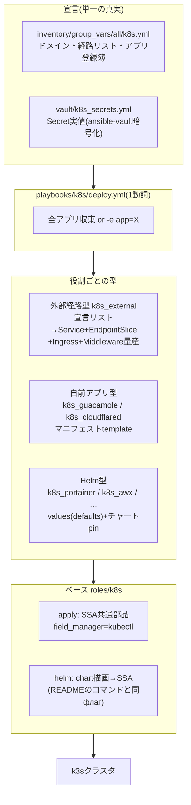

# Phase M 設計書: k8sマニフェストのAnsible完全移行(kustomize解体)

- 日付: 2026-08-13 / 設計: Fable 5 / 実装: GPT-5.6(codex) / 検証: Fable 5
- 前提: Phase 0〜3完了(①②ドメイン稼働、K1でSSA所有権はfield_manager=kubectlへ移行済み)
- 目的: `kubernetes/` のKustomize構成を③ドメインのロール群へ完全移行し、**インベントリ宣言→VM→k8sアプリまで全てAnsibleの1系統**にする

## 1. 現状の棚卸し(実測)

- 適用リソース**82個**。全kustomization.yamlは単純な `resources:` リストのみ(namespace変換・commonLabels・patch等は**一切なし**)→ **生マニフェストの直接適用で完全等価**
- 内訳: Namespace×5 / 証明書系×3 / 外部経路×62(11バックエンド) / アプリIngress+自前アプリ×10 / cloudflared×2
- Helmチャート8本は `helm template | kubectl apply --server-side` 運用(リリース無し)。値はvalues.yaml、バージョンはREADME固定
- Secret16個は `kubernetes/vault/`(git追跡外・平文)。**実測: cloudflare-api-tokenとtunnel-tokenは手元とライブで値が相違**(ライブが正)。awx-oidcは手元のみ(ライブ未適用)
- フィールド所有者: kustomize系=`kubectl`(SSA、K1で移行済み) / Helm系=`helm`+`kubectl`混在 / **Secret=`kubectl-client-side-apply`(初回のみforce必要)**

## 2. 設計

### 2.1 3層構造(①②と同じ思想)



### 2.2 利用者インターフェース(完成形)

```sh
ansible-playbook playbooks/k8s/deploy.yml --check --diff   # 差分確認(Secretはno_logで出ない)
ansible-playbook playbooks/k8s/deploy.yml                  # 全アプリ収束(changed=0が正常)
ansible-playbook playbooks/k8s/deploy.yml -e app=portainer # 1アプリだけ
ansible-playbook playbooks/k8s/deploy.yml -e force=true    # 所有権衝突の初回移行のみ
```

- `apply.yml` / `apply-vault.yml` は**廃止**。Secretも各アプリロールが内包する(vault一元化により「手元が古いかも」問題が構造的に消える)
- 適用順は登録簿 `k8s_apps` の並び順(下記)。依存(cert-manager→証明書、CRD→AWX CR)はロール内のwaitで担保

### 2.3 ロール一覧と適用順(k8s_apps 登録簿)

| # | ロール | 型 | 中身 | Secret(vaultから) |
| --- | --- | --- | --- | --- |
| 1 | `k8s_namespaces` | データ | Namespace×5(リスト宣言) | — |
| 2 | `k8s_cert_manager` | Helm | jetstack v1.21.0 / ns cert-manager / --no-hooks / ns注入なし。webhook Available待ち | — |
| 3 | `k8s_certificates` | 自前 | ClusterIssuer×2 + wildcard Certificate | cloudflare-api-token |
| 4 | `k8s_nfs_provisioner` | Helm | 4.0.18 / ns storage / --no-hooks / **ns注入必須** | — |
| 5 | `k8s_postgresql` | Helm | groundhog2k 1.6.7 / ns注入必須 / hooksあり | postgresql-superuser |
| 6 | `k8s_external` | データ | 経路宣言リスト→62リソース量産 | — |
| 7 | `k8s_cloudflared` | 自前 | Deployment+PDB | tunnel-token |
| 8 | `k8s_guacamole` | 自前 | guacd+guacamole+Ingress | guacamole-db / guacamole-oidc |
| 9 | `k8s_portainer` | Helm | 239.5.0 / --no-hooks + Ingress | — |
| 10 | `k8s_awx` | Helm | awx-operator 3.2.1 / --include-crds / ns注入必須 + Ingress。CRD Established待ち | awx-postgres-configuration / awx-oidc |
| 11 | `k8s_homarr` | Helm | 8.26.0 / ns注入必須 + Ingress | homarr-db / homarr-db-encryption / homarr-oidc |
| 12 | `k8s_pgadmin` | Helm | runix 1.66.0 / --no-hooks + Ingress | pgadmin-admin / pgadmin-oidc / pgadmin-db |
| 13 | `k8s_nextcloud` | Helm | 9.2.5 / ns注入必須 + Ingress | nextcloud-admin / nextcloud-db / nextcloud-oidc |

### 2.4 ベースロール `roles/k8s`

- `tasks/apply.yml`(実装済み): 描画済みYAML文字列を `k8s_definition` で受けてSSA適用。`field_manager: kubectl` 固定(既存所有権をそのまま継承)。`k8s_apply_no_log=true` でSecret保護
- `tasks/helm.yml`: `helm template` を**READMEに記載の実コマンドと同一フラグ**で実行(argv指定、`changed_when: false`)→ stdoutを `apply.yml` へ。パラメータ: `k8s_helm_release / chart / repo_url / version / values(dict) / no_hooks / include_crds / inject_namespace`
  - チャート取得は `--repo <url>` を使い、コントローラの `helm repo add` 状態に依存しない
  - values はロールdefaultsのdictを一時ファイルへ書き出して `--values` に渡す(既存values.yamlと同内容)

### 2.5 外部経路の宣言スキーマ(k8s_external)

62リソースを1つの宣言リストで表現する。**例外が全て表現できることをカタログで確認済み**(supabaseの複数パス/TLS無し、outpostの他サービス参照、technitiumの2ポート、truenasのserverName、pbsの8007):

```yaml
k8s_external_routes:
  - name: technitium-dns          # app.kubernetes.io/name
    backend_ip: 172.16.11.3
    scheme: http                   # serversschemeアノテーション(supabaseのみ省略=none)
    ports: [{name: doh, port: 8053}, {name: web, port: 5380}]
    ingresses:
      - name: technitium-dns-web
        host: dns.cc-chacchan.com
        port: web
        forwarded_https: true      # <ingress名>-forwarded-https Middlewareを生成し付与
      - name: technitium-dns-doh
        host: doh.cc-chacchan.com
        port: doh
  - name: pve01
    backend_ip: 172.16.11.11
    scheme: https
    transport: proxmox             # 共有ServersTransport参照
    ports: [{name: https, port: 8006}]
    ingresses: [{name: pve01, host: pve01.cc-chacchan.com, port: https}]
```

- 個別項目: `entrypoints`(既定 websecure)、`tls: false`、`paths: [...]`、`middlewares: [...]`(forward-auth等の明示連結)、`backend_service`(outpost用の他サービス参照)、`transports`宣言(insecureSkipVerify/serverName)
- テンプレートは `_example/` の正準形を移植し、**ラベル3点セット(`managed-by: kustomize` 含む)を現状のまま維持**(60+リソースの無意味なメタデータ差分を出さないため。K1でHelmラベルを維持したのと同じ判断)

### 2.6 Secretの移行(vault一元化)

- **ソースはライブクラスタ**(手元vault/は2件古いことが実測済み)。例外: `awx-oidc` はライブに無いため手元ファイルから
- 移行スクリプトがライブSecretを読み→ `vault/k8s_secrets.yml` を生成→ `ansible-vault encrypt`(値はログ・画面に出さない)
- 変数名: `k8s_secret_<secret名スネークケース>`(dict: キー名→値)。各ロールのSecretテンプレートが参照
- 適用は `no_log: true` + SSA。**初回のみ** `-e force=true` で `kubectl-client-side-apply` から所有権を引き継ぐ(値が同一であることを--checkで確認してから)
- 効果: Secretが暗号化されてgitにバックアップされる=「ライブにしか無い秘密」が消え、クラスタ全損からの再構築が可能になる

### 2.7 移行の検証ゲート(MIGRATION.md 2026-08-07の規律を踏襲)

| ゲート | 基準 |
| --- | --- |
| M1(自前・データ型: namespaces/certificates/external/cloudflared/guacamole) | `deploy.yml -e app=X --check --diff` が**差分ゼロ**(メタデータ含む)。ゼロでない=転記ミス |
| M2(Helm型8本) | 同上。`helm`マネージャ由来の衝突が出た場合は差分ゼロ確認のうえ初回force |
| M3(Secret) | --checkで変更なし(値一致)を確認→force適用で所有権統一 |
| M4(解体) | `kubernetes/` のマニフェスト・kustomization削除、apply*/README/docs更新。最終 `deploy.yml --check` 全体差分ゼロ |

- 適用後に `kubectl get pods -A` で再起動が起きていないことを確認(SSAの既定値再計算による意図しないロールアウト検知。cloudflaredのimagePullPolicy事例)

## 3. 実装上の厳守事項(Codexへの指示要点)

1. マニフェストは `kubernetes/` の現物から**逐語転記**する。パラメータ化するのは (a) ドメイン名 `cc-chacchan.com` (b) Secret値 (c) 経路宣言リストの項目 のみ。「ついでの改善」禁止
2. ラベル(`managed-by: kustomize`、`pgadmin4`、`part-of: apache-guacamole` 等の非対称も含む)・アノテーション・クォート(`"443"`等の文字列型)・env順序を現状維持
3. `spec.selector` は不変フィールド。転記ミスは適用エラーではなく**サービス断**になる
4. READMEのslugとファイルのslugが食い違う箇所(pga/next-cloud/apache-guacamole)は**ファイルの値**が正
5. Secretを含むタスクは `no_log: true`
6. 実クラスタへの適用はFable 5が行う。Codexは実装とsyntax-checkまで

## 検証記録(2026-08-13 実施)

| ゲート | 結果 |
| --- | --- |
| M1(自前・データ型) | namespaces/external/certificates/cloudflared/guacamole 全て `--check` **changed=0**。外部経路は実測64リソース・17バックエンド(設計書の62/11は誤記)で、宣言生成と現物の構造比較一致をCodexが自己検証、ライブとのSSA dry-run差分ゼロをFable 5が確認 |
| M2(Helm型8本) | values転記は8/8で意味的同値(4本は逐語一致、4本はドメイン変数解決後に一致)を機械照合。cert-manager/nfs/portainer/homarr/pgadmin/nextcloudはライブ差分ゼロ。**真のドリフト2件検出**: postgresql(nextcloud/guacamoleのCREATE DATABASEがライブ未反映)、awx(OIDC設定一式が未適用=awx-oidc Secretがライブに無い理由)。**実装バグ1件検出・修正**: nextcloudチャートの `defaultMode: 0o755`(YAML 1.2 8進)をPyYAMLが文字列扱い→helm.ymlに正規化を追加 |
| M3(Secret) | ライブから16個+バックアップ専用3個を暗号化vault化(値は画面に出さない手順)。`--check` で衝突ゼロ=値の完全一致を確認。Secret適用順をロール先頭へ統一(AWXブートストラップと再構築の順序要件) |
| 適用 | アプリ単位で段階適用。postgresql再起動は22秒で復旧、AWXはOperatorがOIDC設定(awx-oidc-py-secretボリューム)を反映してロールアウト。適用後の異常Pod **0** |
| 最終 | 全体 `deploy.yml --check` = **ok=113 changed=0 failed=0**(完全収束)。kustomize解体(kubernetes/撤去、apply/apply-vault廃止)実施済み |

## 4. 撤去対象(M4) — 実施済み

- `kubernetes/namespaces|platform|cloudflare/`(全マニフェスト+kustomization)、`kubernetes/system/`、`kubernetes/kustomization.yaml`
- `playbooks/k8s/apply.yml` / `apply-vault.yml`
- `kubernetes/vault/`(vault/k8s_secrets.yml へ移行後。git追跡外のため削除は利用者操作)
- `kubernetes/README.md` の運用部分 → `docs/k8s.md` へ統合。マニフェスト設計の解説はロールREADME/コメントへ移す
