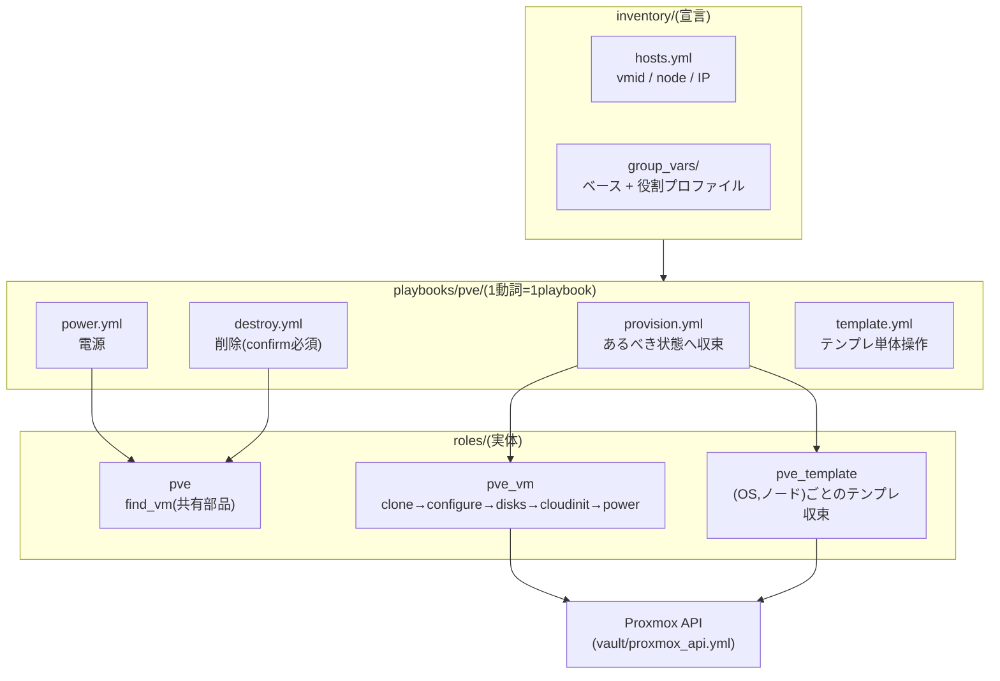

# ① Proxmox操作ドメイン(pve)

Proxmox VEクラスタ上のVMを **宣言的に収束** させるドメイン。ノードへのSSHは行わず、すべて**APIトークン認証**で操作する(トークンは `vault/proxmox_api.yml` の4変数。各playbookが `module_defaults` で全モジュールへ一括供給する)。

## 全体像



- VM変数の既定値一覧と説明は [roles/pve_vm/defaults/main.yml](../roles/pve_vm/defaults/main.yml)、クラスタ共通値(ストレージ・ブリッジ・IP体系)は [inventory/group_vars/all/pve.yml](../inventory/group_vars/all/pve.yml) が正。このドキュメントには書き写さない
- インベントリに無いVMを変数だけで扱う方法は [docs/adhoc.md](adhoc.md)、AWXから実行する前提は [docs/awx.md](awx.md)

## playbook一覧

| playbook | 役割 | 対象・引数の指定 |
| --- | --- | --- |
| [provision.yml](../playbooks/pve/provision.yml) | あるべき状態へ収束 | `-l <グループ/ホスト>` |
| [power.yml](../playbooks/pve/power.yml) | 電源の収束 | `-l <グループ/ホスト>` + `-e state=` |
| [destroy.yml](../playbooks/pve/destroy.yml) | 削除 | `-e vmid= -e confirm=` |
| [template.yml](../playbooks/pve/template.yml) | テンプレートの単体収束 | `-e os= -e version= -e target_node=` |
| [adhoc.yml](../playbooks/pve/adhoc.yml) | 前処理(単体では使わない) | `-e profile=` 指定時のみ動作 |

---

## provision.yml — 宣言どおりに収束させる

```sh
ansible-playbook playbooks/pve/provision.yml              # lab全体
ansible-playbook playbooks/pve/provision.yml -l k8s       # 役割ごと
ansible-playbook playbooks/pve/provision.yml -l yuya-dev  # 1台
```

2つのプレイで収束させる。

1. **テンプレート準備**(`serial: 1`): 対象VMが未作成で、そのノードに(OS, バージョン)のテンプレートが無ければ作る。イメージはPVEノードがチェックサム検証付きで直接ダウンロードする
2. **VM収束**: 未作成ならテンプレートからフルクローン。以降は基本設定(CPU/メモリ/NIC/オプション)→ディスク(拡張のみ)→cloud-init(ユーザー/鍵/IP/DNS)→電源(既定: started)の順に、**差分がある項目だけ**適用する

補足:

- 収束済みなら `changed=0`。何度でも流せる
- 最初にクラスタ共通の基本変数(`pve_storage` 等)が届いているかを検証する。group_vars/allを読み込まない実行環境(AWXの手動インベントリ等)を、API操作の前に不足変数の列挙つきで検出するため
- 稼働中VMへの設定変更はPVE上で保留され、再起動まで反映されないことがある(該当時はメッセージで通知する。電源操作は追加実行しない)

## power.yml — 電源を収束させる

```sh
ansible-playbook playbooks/pve/power.yml -l k8s -e state=started
ansible-playbook playbooks/pve/power.yml -l k8s -e state=stopped
# ゲストが応答しない場合の強制停止
ansible-playbook playbooks/pve/power.yml -l yuya-dev -e state=stopped -e pve_power_force=true
```

- 冪等: すでに目的の状態なら `changed=0`
- `stopped` はゲストOSへの正常シャットダウン要求。起動直後などゲストが応答できない間は失敗する
- 操作前にVMID・VM名・ノードを照合し、宣言と違う実体を掴んだら止まる

## destroy.yml — 削除する

```sh
ansible-playbook playbooks/pve/destroy.yml -e vmid=992 -e confirm=992
ansible-playbook playbooks/pve/destroy.yml -e vmid=992 -e confirm=992 -e purge=true        # バックアップジョブ等も掃除
ansible-playbook playbooks/pve/destroy.yml -e vmid=992 -e confirm=992 -e expect_name=tmp01 # 名前も照合してから削除
```

- 誤操作防止のため**VMIDの二重入力(confirm)が必須**。対象は停止中のVM/テンプレートのみ(起動中なら先にpower.ymlで停止する)
- インベントリを参照せずVMIDだけで動くため、adhocで作った一時VMもそのまま削除できる

## template.yml — テンプレートを単体で収束させる

```sh
ansible-playbook playbooks/pve/template.yml -e os=debian -e version=13 -e target_node=pve01
```

通常はprovisionが必要時に自動で行うため使わない。新しいOSの検証や、構築前のテンプレート事前準備に使う。対応OSとバージョンは下の「テンプレートの仕組み」のカタログを参照。

## adhoc.yml — インベントリ外VMの一時登録(前処理)

provision.yml / power.yml / 各サービスplaybookが先頭でimportする部品。`profile` を指定したときだけ動き、インベントリに無いホストを実行時に登録する。**単体では実行しない**。使いかたは [docs/adhoc.md](adhoc.md)。

---

## VMの宣言のしかた

最小3行。役割グループに置くだけでプロファイル(CPU/メモリ/NIC/SSH鍵…)が適用される。

```yaml
# inventory/hosts.yml
lab:
  children:
    dev:
      hosts:
        new-dev:                       # ホスト名 = PVE上のVM名
          vmid: 703
          node: pve07                  # ノード名で直書き(IPではない)
          ansible_host: 172.16.11.23   # VMのIP(cloud-initにも使われる)
```

上書きしたい値だけホストに足す(フラット変数):

```yaml
        big-dev:
          vmid: 704
          node: pve07
          ansible_host: 172.16.11.24
          pve_vm_cores: 8              # プロファイルの値を個体だけ上書き
          pve_vm_disk_size: 128
          cluster_ip: 10.10.20.24/24   # 2枚目NIC(GWなし)が要る役割のみ
```

変数は「ベース(defaults + group_vars/all)→ 役割プロファイル(group_vars/<役割>.yml)→ 個体(hosts.yml)」の3層で解決される。どんな変数があるかは各defaultsを見る(ここに書き写すと二重管理になるため)。

インベントリに宣言せず、変数だけで1台つくることもできる(使い捨ての検証VM向け)。→ [docs/adhoc.md](adhoc.md)

## テンプレートの仕組み

- **(OS, ノード)ごと**に1つ。全ストレージがノードローカルなため、VMを置くノード上にテンプレートが必要になる
- VMIDは `9XXNN`: XX=OSカタログ番号(下表)、NN=ノード番号。例: debian13をpve03に→`90003`
- provisionが必要に応じて自動作成する(カタログの実体は `roles/pve_template/vars/os/*.yml`)

| OS | バージョン | XX | | OS | バージョン | XX |
| --- | --- | --- | --- | --- | --- | --- |
| Debian | 13 | 00 | | Ubuntu | 24.04 | 05 |
| Ubuntu | 26.04 | 01 | | Ubuntu | 22.04 | 06 |
| Rocky | 10 | 02 | | Rocky | 9 | 07 |
| AlmaLinux | 10 | 03 | | AlmaLinux | 9 | 08 |
| Debian | 12 | 04 | | | | |

## 冪等性の設計

- `proxmox_kvm` の `update` は差分判定をしないため、ロール側で**現在設定と宣言値を比較し、差分がある項目だけ**更新する(収束済みなら `changed=0`)
- NIC更新時は**既存MACアドレスを宣言文字列へ引き継ぐ**(意図しないMAC再生成の防止)
- ディスクは拡張のみ(現在サイズ ≥ 宣言値なら何もしない)
- 例外は cloud-init のパスワード(`cipassword`)。PVEが伏字で返し比較できないため、[playbooks/vm/dev/password.yml](../playbooks/vm/dev/password.yml) は「渡されたら必ず書き込む」方式にしている

## トラブルシューティング

| 症状 | 原因と対処 |
| --- | --- |
| `pve_storage / pve_bridge / ... が未定義です` | inventory/group_vars/all が読み込まれていない。AWXならインベントリをプロジェクトから同期する([docs/awx.md](awx.md))か、列挙された変数を指定する |
| `stopped` が `powerdown failed - got timeout` | ゲストOSがシャットダウン要求に応答できない(起動直後など)。少し待つか `-e pve_power_force=true` |
| `proxmoxer` が見つからない | Dev Containerのリビルド漏れ、またはAWXの実行環境にPython依存が無い([docs/awx.md](awx.md))。`playbooks/pve/*` はコントローラのPythonを使う設計 |
| テンプレートVMIDに「テンプレートではないVMが存在」 | 過去の構築が途中で止まった残骸。PVE UIで確認し、不要なら `destroy.yml` で削除してから再実行 |
| destroyが拒否される | 仕様: `confirm` の不一致、または対象が起動中。`power.yml` で停止してから |
