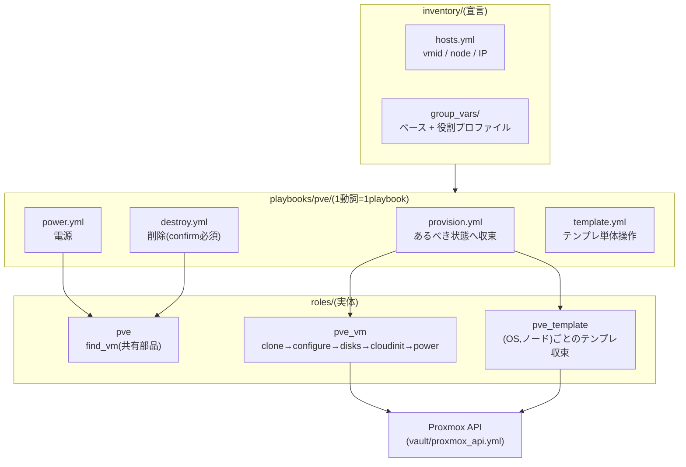

# ① Proxmox操作ドメイン(pve)

Proxmox VEクラスタ上のVMを **宣言的に収束** させるドメイン。ノードへのSSHは行わず、すべて**APIトークン認証**で操作する。

## 全体像



## コマンド

```sh
# 宣言どおりに収束(なければテンプレ準備→クローン、あれば設定差分だけ適用)
ansible-playbook playbooks/pve/provision.yml              # lab全体
ansible-playbook playbooks/pve/provision.yml -l k8s      # 役割ごと
ansible-playbook playbooks/pve/provision.yml -l yuya-dev # 1台

# 電源(冪等: すでに目的の状態なら changed=0)
ansible-playbook playbooks/pve/power.yml -l k8s -e state=started
ansible-playbook playbooks/pve/power.yml -l k8s -e state=stopped
# ゲストが応答しない場合の強制停止
ansible-playbook playbooks/pve/power.yml -l yuya-dev -e state=stopped -e pve_power_force=true

# 削除(誤操作防止のためVMIDの二重入力が必須。停止中のVM/テンプレートのみ)
ansible-playbook playbooks/pve/destroy.yml -e vmid=992 -e confirm=992
ansible-playbook playbooks/pve/destroy.yml -e vmid=992 -e confirm=992 -e purge=true  # バックアップジョブ等も掃除

# テンプレートの単体操作(通常はprovisionが自動で行うため不要)
ansible-playbook playbooks/pve/template.yml -e os=debian -e version=13 -e target_node=pve01
```

## VMの宣言のしかた

最小3行。役割グループに置くだけでプロファイル(CPU/メモリ/NIC/SSH鍵…)が適用される。

```yaml
# inventory/hosts.yml
lab:
  children:
    dev:
      hosts:
        new-dev:                       # ホスト名 = PVE上のVM名
          vmid: 703
          node: pve07                  # ノード名で直書き(IPではない)
          ansible_host: 172.16.11.23   # VMのIP(cloud-initにも使われる)
```

上書きしたい値だけホストに足す(フラット変数):

```yaml
        big-dev:
          vmid: 704
          node: pve07
          ansible_host: 172.16.11.24
          pve_vm_cores: 8          # プロファイルの値を個体だけ上書き
          pve_vm_disk_size: 128
          cluster_ip: 10.10.20.24/24  # 2枚目NIC(GWなし)が要る役割のみ
```

主要変数(既定値の一覧は `roles/pve_vm/defaults/main.yml` が正):

| 変数 | 意味 | 既定 |
| --- | --- | --- |
| `pve_vm_cores` / `pve_vm_memory` | CPUコア / メモリ(MiB) | 2 / 2048 |
| `pve_vm_disk_size` | 起動ディスクGiB(**拡張のみ**。縮小は無視) | 20 |
| `pve_vm_nets` | NICリスト(`[{bridge: vmbr0}, …]`) | vmbr0×1 |
| `pve_vm_disks` | 追加ディスク(PBSのバックアップ用等) | なし |
| `pve_os` / `pve_os_version` | クローン元テンプレートのOS | debian / 13 |
| `pve_vm_power` | provision後の電源(`started`/`stopped`) | started |
| `pve_ssh_user` / `pve_ssh_pubkey_file` | cloud-initが作るユーザーと公開鍵 | なし(未定義ならスキップ) |

インベントリに宣言せず、`-e` だけで1台つくることもできる(使い捨ての検証VM向け)。→ [docs/adhoc.md](adhoc.md)

```sh
ansible-playbook playbooks/pve/provision.yml \
  -e target=tmp01 -e profile=dev -e vmid=799 -e node=pve07 -e ip=172.16.11.99
```

## テンプレートの仕組み

- **(OS, ノード)ごと**に1つ。全ストレージがノードローカルなため、VMを置くノード上にテンプレートが必要になる
- VMIDは `9XXNN`: XX=OSカタログ番号(下表)、NN=ノード番号。例: debian13をpve03に→`90003`
- provisionが必要に応じて自動作成する(イメージはPVEがチェックサム検証付きで直接ダウンロード)

| OS | バージョン | XX | | OS | バージョン | XX |
| --- | --- | --- | --- | --- | --- | --- |
| Debian | 13 | 00 | | Ubuntu | 24.04 | 05 |
| Ubuntu | 26.04 | 01 | | Ubuntu | 22.04 | 06 |
| Rocky | 10 | 02 | | Rocky | 9 | 07 |
| AlmaLinux | 10 | 03 | | AlmaLinux | 9 | 08 |
| Debian | 12 | 04 | | | | |

## 冪等性の設計

- `proxmox_kvm` の `update` は差分判定をしないため、ロール側で**現在設定と宣言値を比較し、差分がある項目だけ**更新する(収束済みなら `changed=0`)
- NIC更新時は**既存MACアドレスを宣言文字列へ引き継ぐ**(意図しないMAC再生成の防止)
- ディスクは拡張のみ(現在サイズ ≥ 宣言値なら何もしない)

## トラブルシューティング

| 症状 | 原因と対処 |
| --- | --- |
| `stopped` が `powerdown failed - got timeout` | ゲストOSがシャットダウン要求に応答できない(起動直後など)。少し待つか `-e pve_power_force=true` |
| `proxmoxer` が見つからない | Dev Containerのリビルド漏れ。`playbooks/pve/*` はコントローラのPythonを使う設計(プレイ内 `ansible_python_interpreter`) |
| テンプレートVMIDに「テンプレートではないVMが存在」 | 過去の構築が途中で止まった残骸。PVE UIで確認し、不要なら `destroy.yml` で削除してから再実行 |
| destroyが拒否される | 仕様: `confirm` の不一致、または対象が起動中。`power.yml` で停止してから |
