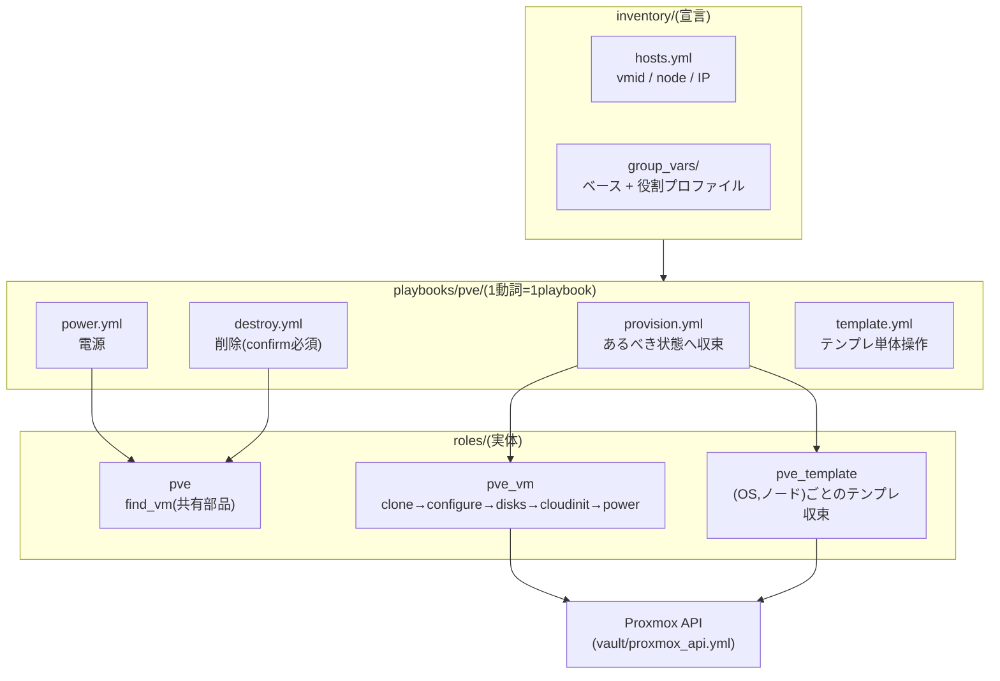

# ① Proxmox操作ドメイン(pve)

Proxmox VEクラスタ上のVMを **宣言的に収束** させるドメイン。ノードへのSSHは行わず、すべて**APIトークン認証**で操作する(トークンは `vault/proxmox_api.yml` の4変数。各playbookが `module_defaults` で全モジュールへ一括供給する)。

## 全体像



- VM変数の既定値一覧と説明は [roles/pve_vm/defaults/main.yml](../../roles/pve_vm/defaults/main.yml)、クラスタ共通値(ストレージ・ブリッジ・IP体系)は [inventory/group_vars/all/pve.yml](../../inventory/group_vars/all/pve.yml) が正。このドキュメントには書き写さない
- AWXから実行する前提は [docs/awx/](../awx/README.md)

## playbook一覧(1ページ=1playbook)

| playbook | ドキュメント | 役割 |
| --- | --- | --- |
| [provision.yml](../../playbooks/pve/provision.yml) | [provision.md](provision.md) | あるべき状態へ収束 |
| [power.yml](../../playbooks/pve/power.yml) | [power.md](power.md) | 電源の収束 |
| [destroy.yml](../../playbooks/pve/destroy.yml) | [destroy.md](destroy.md) | 削除(vmid二重入力) |
| [template.yml](../../playbooks/pve/template.yml) | [template.md](template.md) | テンプレートの単体収束 |
| [adhoc.yml](../../playbooks/pve/adhoc.yml) | [adhoc.md](adhoc.md) | インベントリ外VMの一時登録(前処理。単体では使わない) |

## 実行方式は二本立て

どのplaybookも **同じ変数名** で2通りに実行できる(実装は分岐していない。extra varsがインベントリ変数より優先されるというAnsible標準の優先順位を使っているだけ)。

1. **インベントリ実行**: `inventory/hosts.yml` の宣言どおりに再現する。変数は3層(ベース→役割プロファイル→個体)で解決される
2. **直接実行**: インベントリに無いVMを `-e`(またはAWXのSurvey)だけで扱う。`-e profile=` を指定したときだけ [adhoc.yml](adhoc.md) が一時ホストを登録する

## VMの宣言のしかた(インベントリ実行)

最小3行。役割グループに置くだけでプロファイル(CPU/メモリ/NIC/SSH鍵…)が適用される。

```yaml
# inventory/hosts.yml
lab:
  children:
    dev:
      hosts:
        new-dev:                       # ホスト名 = PVE上のVM名
          vmid: 703
          node: pve07                  # ノード名で直書き(IPではない)
          ansible_host: 172.16.11.23   # VMのIP(cloud-initにも使われる)
```

上書きしたい値だけホストに足す(フラット変数):

```yaml
        big-dev:
          vmid: 704
          node: pve07
          ansible_host: 172.16.11.24
          pve_vm_cores: 8              # プロファイルの値を個体だけ上書き
          pve_vm_disk_size: 128
          cluster_ip: 10.10.20.24/24   # 2枚目NIC(GWなし)が要る役割のみ
```

変数は「ベース(defaults + group_vars/all)→ 役割プロファイル(group_vars/<役割>.yml)→ 個体(hosts.yml)」の3層で解決される。どんな変数があるかは各defaultsを見る(ここに書き写すと二重管理になるため)。

## ストレージ・NIC・ディスクの宣言(何個でも)

ストレージ名やNIC構成は**固定ではない**。すべて変数で、3層のどこでも(および `-e` / AWXでも)上書きできる。

### ブートディスクのストレージ(pve_storage)

`group_vars/all/pve.yml` の既定は `ssd01` だが、役割・個体ごとに自由に変えられる(実例: authentik=`local-lvm`、supabase=`ssd02`)。対象ノードに存在するストレージ名を指定する。

```yaml
# 役割ごと(group_vars/<役割>.yml)         # 個体ごと(hosts.yml)         # 実行時
pve_storage: ssd02                          pve_storage: local-lvm        -e pve_storage=ssd02
```

### NIC(pve_vm_nets)— 任意の枚数

リストの並び順どおりに `net0, net1, ...` として収束する(既定は `[{bridge: vmbr0}]` の1枚)。

```yaml
pve_vm_nets:
  - bridge: vmbr0     # net0
  - bridge: vmbr2     # net1
  - bridge: vmbr3     # net2(何枚でも)
```

**cloud-initが自動設定するIPは最初の2枚だけ**: net0=`ansible_host`(直接実行では `-e ip=`)、net1=`cluster_ip`(同 `-e ip2=`)。3枚目以降はNICとして接続されるが、IPはゲストOS内で設定する(この制約は cloud-init 連携の仕様として意図的)。

### 追加ディスク(pve_vm_disks)— 任意の本数・ディスクごとにストレージ指定可

ブートディスク(scsi0)とは別に、任意の本数を宣言できる。**ディスクごとに別のストレージを指せる**(実例: pbsのバックアップ用HDD)。

```yaml
pve_vm_disks:
  - bus: scsi        # scsi1 になる
    index: 1
    storage: hdd01   # このディスクだけ別ストレージ
    size: 500
    ssd: false
    iothread: true
    discard: "on"
```

### ハードウェア設定(すべて変数)

BIOSやSSDエミュレーションなどのハードウェア相当の設定もすべて同じ3層+`-e`/Surveyで選べる。既定値の正は [roles/pve_vm/defaults/main.yml](../../roles/pve_vm/defaults/main.yml) と [inventory/group_vars/all/pve.yml](../../inventory/group_vars/all/pve.yml)。

| 変数 | 既定値 | 選べる値(代表) |
| --- | --- | --- |
| `pve_bridge` | `vmbr0` | 1枚目NICのブリッジ(vmbr0 / vmbr1 / …) |
| `pve_vm_bios` | `seabios` | `seabios` / `ovmf`(UEFI) |
| `pve_vm_machine` | `q35` | `q35` / `pc`(i440fx) |
| `pve_vm_vga` | `std` | `std` / `serial0` / `qxl` / `virtio` |
| `pve_vm_cpu_type` | `x86-64-v2-AES` | `x86-64-v3` / `host` 等 |
| `pve_vm_disk_ssd` | `1` | SSDエミュレーション(1=有効 / 0=無効) |
| `pve_vm_disk_iothread` | `1` | IO Thread(1 / 0) |
| `pve_vm_disk_discard` | `on` | Discard/TRIM(`on` / `ignore`) |
| `pve_vm_onboot` | `1` | ホスト起動時の自動起動(1 / 0) |
| `pve_vm_agent` | `1` | QEMUゲストエージェント(0にすると正常シャットダウンやパスワード反映が効かなくなる) |
| `pve_vm_power` | `started` | 収束後の電源状態(`started` / `stopped`) |

AWXでは共通Surveyの「ハードウェア設定」質問群から選択できる(未回答なら宣言値)。

### AWXでの渡しかた

`pve_storage` のようなスカラー値はSurveyに質問がある。`pve_vm_nets` / `pve_vm_disks` のような**リストはSurveyでは渡せない**(AWX Surveyの仕様)ため、Job Templateの**「変数」欄にYAMLで書く**(全JTで変数欄は有効化済み)。手元の `-e` ではJSONで渡す:

```sh
ansible-playbook playbooks/pve/provision.yml -e target=tmp02 -e profile=lab \
  -e vmid=798 -e node=pve06 -e ip=172.16.11.98 -e pve_storage=ssd02 \
  -e '{"pve_vm_nets":[{"bridge":"vmbr0"},{"bridge":"vmbr2"}]}' \
  -e '{"pve_vm_disks":[{"bus":"scsi","index":1,"storage":"local-lvm","size":100,"ssd":true,"iothread":true,"discard":"on"}]}'
```

## テンプレートの仕組み

- **(OS, ノード)ごと**に1つ。全ストレージがノードローカルなため、VMを置くノード上にテンプレートが必要になる
- VMIDは `9XXNN`: XX=OSカタログ番号(下表)、NN=ノード番号。例: debian13をpve03に→`90003`
- provisionが必要に応じて自動作成する(カタログの実体は `roles/pve_template/vars/os/*.yml`)

| OS | バージョン | XX | | OS | バージョン | XX |
| --- | --- | --- | --- | --- | --- | --- |
| Debian | 13 | 00 | | Ubuntu | 24.04 | 05 |
| Ubuntu | 26.04 | 01 | | Ubuntu | 22.04 | 06 |
| Rocky | 10 | 02 | | Rocky | 9 | 07 |
| AlmaLinux | 10 | 03 | | AlmaLinux | 9 | 08 |
| Debian | 12 | 04 | | | | |

## 冪等性の設計

- `proxmox_kvm` の `update` は差分判定をしないため、ロール側で**現在設定と宣言値を比較し、差分がある項目だけ**更新する(収束済みなら `changed=0`)
- NIC更新時は**既存MACアドレスを宣言文字列へ引き継ぐ**(意図しないMAC再生成の防止)
- ディスクは拡張のみ(現在サイズ ≥ 宣言値なら何もしない)
- 例外は cloud-init のパスワード(`cipassword`)。PVEが伏字で返し比較できないため、[playbooks/vm/dev/password.yml](../../playbooks/vm/dev/password.yml) は「渡されたら必ず書き込む」方式にしている

## トラブルシューティング(ドメイン共通)

| 症状 | 原因と対処 |
| --- | --- |
| `pve_storage / pve_bridge / ... が未定義です` | inventory/group_vars/all が読み込まれていない。AWXならインベントリをプロジェクトから同期する([docs/awx/](../awx/README.md))か、列挙された変数を指定する |
| `vmid / node / ansible_host が未定義です` | ホストの宣言漏れ、またはインベントリ外VMの指定漏れ。`-e profile=` とあわせて `-e vmid= -e node= -e ip=` を渡す([adhoc.md](adhoc.md)) |
| `stopped` が `powerdown failed - got timeout` | ゲストOSがシャットダウン要求に応答できない(起動直後など)。少し待つか `-e pve_power_force=true` |
| `proxmoxer` が見つからない | Dev Containerのリビルド漏れ、またはAWXの実行環境にPython依存が無い([docs/awx/](../awx/README.md))。`playbooks/pve/*` はコントローラのPythonを使う設計 |
| テンプレートVMIDに「テンプレートではないVMが存在」 | 過去の構築が途中で止まった残骸。PVE UIで確認し、不要なら `destroy.yml` で削除してから再実行 |
| destroyが拒否される | 仕様: `confirm` の不一致、または対象が起動中。`power.yml` で停止してから |
