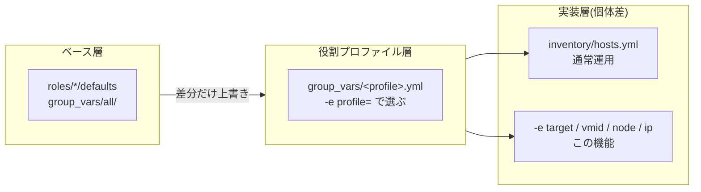

# adhoc.yml — インベントリ外のVMを変数だけで構築する

`inventory/hosts.yml` に宣言していないVMを、コマンドラインの `-e`(またはAWXのSurvey)だけで構築するための**前処理部品**。使い捨ての検証VM、宣言を書く前の新サービスの試作、同じ役割の一時的な増設に使う。

`-e profile=<役割グループ>` を指定したときだけ動き、無ければ何もしないため**通常のインベントリ運用には一切影響しない**。provision.yml / power.yml / 各サービスplaybookが先頭でimportする部品であり、**単体では実行しない**。

> **恒久的に運用するVMは `inventory/hosts.yml` に宣言する。** この機能は宣言を置き換えるものではなく、宣言を書く前の実験用。気に入ったら[インベントリへ移す](#気に入ったらインベントリへ移す)。

## 実行方法

### ① VMだけ作る

```sh
# devプロファイルを継承(CPU/メモリ/ディスク/ユーザーは group_vars/dev.yml から)
ansible-playbook playbooks/pve/provision.yml \
  -e target=tmp01 -e profile=dev -e vmid=799 -e node=pve07 -e ip=172.16.11.99

# プロファイルを継承せず(profile=lab)、必要な値だけ自分で決める
ansible-playbook playbooks/pve/provision.yml \
  -e target=tmp02 -e profile=lab -e vmid=798 -e node=pve06 -e ip=172.16.11.98 \
  -e pve_vm_cores=4 -e pve_vm_memory=4096 -e pve_vm_disk_size=40 \
  -e pve_os=ubuntu -e pve_os_version=24.04

# ストレージを変えて、NICと追加ディスクを複数持たせる
# (pve_vm_nets / pve_vm_disks はリストのためJSONで渡す)
ansible-playbook playbooks/pve/provision.yml \
  -e target=tmp03 -e profile=lab -e vmid=797 -e node=pve05 -e ip=172.16.11.97 \
  -e pve_storage=local-lvm \
  -e '{"pve_vm_nets":[{"bridge":"vmbr0"},{"bridge":"vmbr2"}]}' \
  -e '{"pve_vm_disks":[{"bus":"scsi","index":1,"storage":"ssd02","size":100,"ssd":true,"iothread":true,"discard":"on"}]}'
```

### ② サービスまで一気通貫

```sh
# 2台目のTechnitium DNSを検証用に立てる(サービス設定も group_vars/technitium.yml から継承)
ansible-playbook playbooks/vm/technitium.yml \
  -e target=technitium-dns02 -e profile=technitium \
  -e vmid=605 -e node=pve06 -e ip=172.16.11.91

# k3sワーカーを1台だけ追加する(参加先のコントロールプレーンは宣言から自動解決される)
ansible-playbook playbooks/vm/k3s.yml \
  -e target=k3s-worker05 -e profile=k8s \
  -e vmid=802 -e node=pve08 -e ip=172.16.12.19 -e ip2=10.10.20.19/24

# サービス設定を-eで変えて立てる(group_vars/<役割>.yml の値を個体だけ上書き)
ansible-playbook playbooks/vm/wg-easy.yml \
  -e target=wg-easy02 -e profile=wg_easy \
  -e vmid=506 -e node=pve05 -e ip=172.16.11.32 \
  -e wg_easy_init_host=vpn2.cc-chacchan.com -e wg_easy_wg_port=51822
```

### ③ 電源と削除

```sh
# 停止(削除するには先に停止が必要)
ansible-playbook playbooks/pve/power.yml -e state=stopped \
  -e target=tmp01 -e profile=dev -e vmid=799 -e node=pve07 -e ip=172.16.11.99

# 削除(VMIDだけで動くため profile などは不要)
ansible-playbook playbooks/pve/destroy.yml -e vmid=799 -e confirm=799
```

### 気に入ったらインベントリへ移す

`-e` の指定が、そのまま `inventory/hosts.yml` の1行になる。移したあとは `-e` なしの通常運用に戻る。

| 実行時の `-e` | インベントリでの書きかた |
| --- | --- |
| `-e target=tmp01` | ホスト名 `tmp01:` |
| `-e profile=dev` | `dev:` グループの下に置く |
| `-e vmid=799` | `vmid: 799` |
| `-e node=pve07` | `node: pve07` |
| `-e ip=172.16.11.99` | `ansible_host: 172.16.11.99` |
| `-e ip2=10.10.20.19/24` | `cluster_ip: 10.10.20.19/24` |
| `-e pve_vm_memory=4096` | `pve_vm_memory: 4096` |

## 変数一覧

| 変数 | 必須 | 意味 | 例 |
| --- | :-: | --- | --- |
| `target` | ✔ | 新しいホスト名。そのままPVE上のVM名になる | `tmp01` |
| `profile` | ✔ | 継承する役割グループ。継承せず値を全部自分で渡すなら `lab`(labはどのplaybookとも組み合わせられる) | `dev` |
| `vmid` | ✔ | VMID | `799` |
| `node` | ✔ | 配置するPVEノード | `pve07` |
| `ip` | ✔ | 1枚目NICのIP(= `ansible_host`) | `172.16.11.99` |
| `ip2` | | 2枚目NICのIP(= `cluster_ip`)。プレフィックス付き。NIC2枚の役割のみ | `10.10.20.19/24` |

**これ以外は普段どおりの変数名でよい**。上書きしたい値を `-e pve_vm_memory=4096` や `-e pve_storage=ssd02` のように足すだけで、優先順位はAnsible標準のまま(`-e` が最優先)。指定できる変数の一覧は各playbookのページと `roles/*/defaults/main.yml` が正。ストレージ・NIC・追加ディスクを任意個指定する書式は [README.md](README.md#ストレージnicディスクの宣言何個でも)。

> IPだけ `-e ansible_host=` ではなく `-e ip=` を使う。`-e` は**全ホストへ最優先で効く**ため、`ansible_host` を直接渡すと `hostvars[別ホスト].ansible_host` を参照している箇所(`group_vars/k8s.yml` の `kubernetes_server_ip` など)まで書き換わってしまう。adhoc.ymlが `ip` を新ホストのホスト変数として登録することで、他ホストを汚さずに済ませている。

### profile名の調べかた

profileの実体は**インベントリの役割グループ**(= `inventory/group_vars/<名前>.yml` を持つグループ)。次のどちらでも一覧できる:

```sh
# グループ階層ごと見る(labの子グループ=プロファイル)
ansible-inventory --graph lab

# プロファイル定義ファイルの一覧から見る(all/ は共通値なので除く)
ls inventory/group_vars/ | grep -v '^all'
```

グループを追加すれば、そのままprofileとして使える(AWXのSurvey選択肢は `playbooks/utils/awx/configure.yml` の再実行で追従する)。どの役割グループとも違う構成を試すときは `profile=lab`(何も継承せず、必要な値を全部 `-e` で渡す)。

## 動きかた

`-e profile=<役割グループ>` を指定したときだけ、[playbooks/pve/adhoc.yml](../../playbooks/pve/adhoc.yml) が実行時にホストを1台つくり、そのグループへ入れる。
以降は**インベントリに書いたホストとまったく同じ**に扱われるため、3層の変数解決もそのまま効く。



## AWXでの実行

adhoc.yml自体はJob Templateにしない(前処理部品のため)。各Job Template(`pve-provision` / `vm-*`)の共通Surveyに `target` / `profile` / `vmid` / `node` / `ip` / `ip2` が入っており、**Surveyに回答するだけでこのページの直接実行と同じ動きになる**(SurveyはextraVarsとして届くため)。

- Surveyの未回答は「変数を送らない」扱いになるよう定義済み(空文字が届くと `target` は安全のため実行を中止する)
- 鍵はSurveyの `pve_ssh_pubkey_value` / `pve_ssh_prikey_value` に**本文**で渡す

## つまずきやすいポイント

- **`-l`(`--limit`)と併用しない** → ホストを登録するlocalhostのプレイまで除外され、対象が0台になる。絞り込みは `-e target=` が行う
- **1回の実行で作れるのは1台**
- **作ったVMは宣言に残らない** → 一時ホストはその実行かぎりで、以降 `provision.yml`(lab全体)の収束対象には入らない。使い続けるならインベントリへ移す
- **IPは `-e ip=` / `-e ip2=` で渡す** → `-e ansible_host=` や `-e cluster_ip=` を直接指定すると全ホストに効いてしまう
- **`profile=lab`(継承なし)でSSHまで進む場合** → cloud-initが作るユーザーと鍵を自分で渡す:
  `-e pve_ssh_user=<ユーザー名> -e pve_ssh_pubkey_file=~/.ssh/<公開鍵> -e pve_ssh_prikey_file=~/.ssh/<秘密鍵>`
  (AWXのSurveyなどパスを置けない環境では鍵の本文で渡せる → [docs/vm/ssh_key.md](../vm/ssh_key.md))
- **`profile=lab` を別セグメント(vmbr2など)に置く** → デフォルトゲートウェイは `group_vars/all/pve.yml` の値のため、`-e pve_ipv4_gw=` と `-e '{"pve_vm_nets":[{"bridge":"vmbr2"}]}'` も指定する
- **`--list-hosts` では対象を確認できない** → ホストの登録は実行時に行われるため
- **インベントリが届かない実行(AWXの手動インベントリ等)ではIP重複チェックが実質skipされる** → 比較相手の宣言が無いため。この形態で使うときはIPの衝突を自分で確認する

### 実行前に止まるもの

指定ミスは adhoc.yml が **Proxmoxに触る前** に検出して停止する。

| 止まる条件 | 例 |
| --- | --- |
| `target` が既存のホスト名・グループ名 | `-e target=yuya-dev` / `-e target=dev` |
| `target` が存在しない(profile未指定時)。打ち間違いを「対象0台の成功」にしない | `-e target=yuya-devv` |
| `target` にインベントリパターンが混ざっている(単一のホスト名/グループ名のみ) | `-e target=all:!dev` |
| `target` がplaybookの前提と違う役割の既存ホスト ※ | `dev/password.yml -e target=technitium-dns` |
| `profile` が存在しない役割グループ ※ | `-e profile=devv` |
| `profile` がplaybookの前提と違う(`lab` は除く) | `playbooks/vm/dev/setup.yml -e profile=k8s` |
| `vmid` / `node` / `ip` / `ip2` の書式ミス・指定漏れ(IPはオクテット範囲も見る) | `-e ip=999.9.9.9` |
| `ip` / `ip2` がインベントリ既存VMのIPと重複 | `-e ip=172.16.11.21` |
| `target` が空文字(AWXのSurvey未回答など) | `-e target=` ※対象が意図せず広がるため |
| クラスタ共通の基本変数が届いていない(provision実行時) | AWXの手動インベントリ等。不足分を列挙して停止 |

※ グループを参照する検査は、プロジェクトのインベントリを読めているときだけ判定できる。読めていない実行環境(AWXの手動インベントリ等)では、プロファイルが適用されない旨を表示したうえで、実際に使う値が揃っているかをprovisionの基本変数チェックが確認する。

VMIDの重複はインベントリでは判定できない(extra varsが全ホストへ効くため)。実機との突き合わせを `roles/pve` の検索が行い、宣言と違う名前・ノードのVMを掴んだら停止する。
