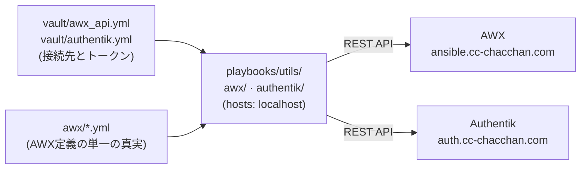

# 単発ツール(utils)ドメイン

`playbooks/utils/` は**単発で叩く実用ツール集**(Ansibleにおけるシェルスクリプト集に相当)。①②③のインフラドメインとは責務を分けており、**構成管理(宣言の収束)ではなく、APIを叩く単発の操作**を対象サービスごとのサブディレクトリへ置く。

## 全体像



```
playbooks/utils/
├── awx/         # AWX REST APIの操作(設定収束・Job起動・状況取得・Inventory同期)
└── authentik/   # Authentik REST APIの操作(ユーザー/グループ管理)
```

## playbook一覧(1ページ=1playbook)

| playbook | ドキュメント | 何をするか | 使うvault |
| --- | --- | --- | --- |
| [awx/configure.yml](../../playbooks/utils/awx/configure.yml) | [awx/configure.md](awx/configure.md) | AWX側の設定(Project/Inventory/Credential/EE/JT+Survey)を定義どおりに収束 | `awx_api.yml` |
| [awx/job_launch.yml](../../playbooks/utils/awx/job_launch.yml) | [awx/job_launch.md](awx/job_launch.md) | Job Templateを名前指定で起動(既定で完了待ち) | `awx_api.yml` |
| [awx/job_status.yml](../../playbooks/utils/awx/job_status.yml) | [awx/job_status.md](awx/job_status.md) | Jobの状況取得(オプションで完了待ち) | `awx_api.yml` |
| [awx/inventory_sync.yml](../../playbooks/utils/awx/inventory_sync.yml) | [awx/inventory_sync.md](awx/inventory_sync.md) | Inventory Source(project-inventory)の同期 | `awx_api.yml` |
| [authentik/users.yml](../../playbooks/utils/authentik/users.yml) | [authentik/users.md](authentik/users.md) | ユーザー作成(単一/一括)+グループ所属(冪等) | `authentik.yml` |

## 共通の動作

1. すべて **localhost実行**(SSH不要)。リポジトリルートから `ansible-playbook playbooks/utils/<サービス>/<name>.yml` で実行する
2. `--check` には対応しない(API呼び出しのみのため)。先頭のassertで明示的に止まる
3. 認証ヘッダは `module_defaults` で供給し、API呼び出しは `no_log`、直後のassertで成否だけを判定する
4. vaultの復号は他playbookと同じ(Dev Containerでは `ANSIBLE_VAULT_PASSWORD_FILE` で自動)
5. `awx/configure.yml` 以外はAWXからも実行できる(Job Template `utils-*`。定義は [awx/job_templates.yml](../../awx/job_templates.yml)、前提は [docs/utils/awx/README.md](awx/README.md))。configure.yml だけはAWXが自分の定義を書き換えるループを避けるため、外側(DevContainer等)から実行する

## 共通の変数

| ファイル | 変数 | 内容 |
| --- | --- | --- |
| `vault/awx_api.yml` | `vault_awx_host` / `vault_awx_oauthtoken` | AWXのURLとOAuthトークン |
| | `vault_awx_scm_prikey` | ProjectのSSH同期用GitHub秘密鍵(configure.ymlのみ使用) |
| `vault/authentik.yml` | `vault_authentik_host` | AuthentikのURL(例 `https://auth.cc-chacchan.com`) |
| | `vault_authentik_api_token` | APIトークン(Directory → Tokens で intent=API を発行) |

編集は `ansible-vault edit vault/<ファイル>.yml`(全ファイル同一パスワード。[vault/README.md](../../vault/README.md))。
