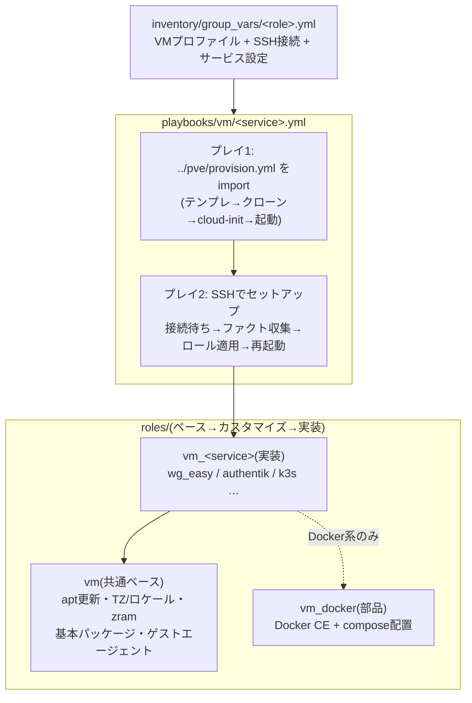
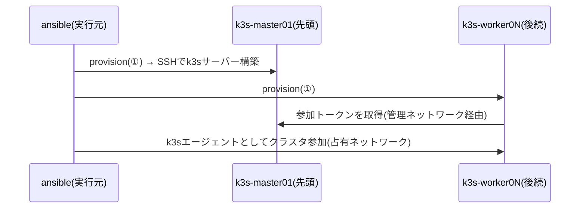

# ② VMセットアップドメイン(vm)

VMの**中身**(OS設定・Docker・サービス)をSSHで収束させるドメイン。1サービス=1playbookで、①pveドメインのprovisionを先頭でimportするため、**インベントリの宣言から稼働中サービスまで一気通貫**で構築できる。

## 全体像



## コマンド

```sh
# 宣言から一気通貫で構築(既存VMなら差分適用のみ)
ansible-playbook playbooks/vm/wg-easy.yml
ansible-playbook playbooks/vm/authentik.yml
ansible-playbook playbooks/vm/k3s.yml        # k8sグループ全台を順にクラスタ化

# 1台だけに絞る(グループ内の特定ホスト)
ansible-playbook playbooks/vm/dev/setup.yml -l yuya-dev

# 仕上げの再起動を抑止する(稼働中サービスの設定だけ直したいとき)
ansible-playbook playbooks/vm/wg-easy.yml -e vm_reboot_after_setup=false
```

対象は8サービス。開発VMだけ動詞が2つあるため、`playbooks/pve/` と同じ考えかたでディレクトリに分けている。

| ファイル | 役割 |
| --- | --- |
| `authentik.yml` `ddns.yml` `k3s.yml` `pbs.yml` `supabase.yml` `technitium.yml` `wg-easy.yml` | 1サービス=1ファイル |
| [`dev/setup.yml`](../playbooks/vm/dev/setup.yml) | 開発VMを一通り構築(パスワード設定も含む) |
| [`dev/password.yml`](../playbooks/vm/dev/password.yml) | 開発VMのログインパスワードだけ更新 |
| [`ssh_key.yml`](../playbooks/vm/ssh_key.yml) | 各playbookが先頭でimportする前処理(鍵を本文で受け取ったとき用) |

## サービスの宣言のしかた

役割グループの `inventory/group_vars/<role>.yml` に3種類の変数をまとめる。

```yaml
# inventory/group_vars/wg_easy.yml
# --- ① VMプロファイル(pveドメインが使う) ---
pve_vm_cores: 2
pve_vm_memory: 512
pve_vm_disk_size: 8

# --- ② SSH接続(cloud-initが作るユーザーと鍵) ---
pve_ssh_user: wg
pve_ssh_pubkey_file: ~/.ssh/id_ed25519_wg_easy.pub
pve_ssh_prikey_file: ~/.ssh/id_ed25519_wg_easy

# --- ③ サービス設定(vm_<service>ロールが使う) ---
wg_easy_init_host: wg.example.com
wg_easy_version: "15.4.0-beta.1"
```

- SSH接続は **provisionがcloud-initに書き込んだユーザー・鍵をそのまま使う**ため、宣言が一致していれば必ず入れる
- 秘密情報(APIトークン等)は平文で置かず `vault/` の暗号化ファイルに置く

### 鍵をファイルではなく本文で渡す(AWXのSurveyなど)

AWXのSurveyはファイル入力に対応していない。鍵をパスで置けない実行環境では、**鍵の本文をそのまま入れる変数**を代わりに使う。

| ファイルで渡す(既定) | 本文で渡す | 中身 |
| --- | --- | --- |
| `pve_ssh_pubkey_file` | `pve_ssh_pubkey_value` | cloud-initがVMに登録する公開鍵 |
| `pve_ssh_prikey_file` | `pve_ssh_prikey_value` | AnsibleがVMへSSHする秘密鍵 |

**本文が入っていればファイル指定より優先される**ため、`group_vars/<役割>.yml` の宣言は書き換えなくてよい。AWXではSurveyの質問を「テキストエリア」で作り、変数名を `pve_ssh_pubkey_value` / `pve_ssh_prikey_value` にする(秘密鍵の質問は**暗号化を有効にする**)。

秘密鍵はSSHがファイルしか受け付けないため、[playbooks/vm/ssh_key.yml](../playbooks/vm/ssh_key.yml) が各playbookの先頭で `~/.ansible/pve_ssh_keys/<鍵のハッシュ>` へ0600で書き出し、接続にはそれを指す `pve_ssh_prikey_resolved` を使う。本文を渡さなければこのプレイは何もしない。

```sh
# コマンドラインから渡すときはJSONで。-e key=value は複数行が1行目で切れる
ansible-playbook playbooks/vm/wg-easy.yml -e @keys.json
```

- 書き出した秘密鍵は実行後も残る。AWXは実行環境コンテナごと破棄されるが、手元で試したときは `~/.ansible/pve_ssh_keys/` を消す
- AWXの **Machine Credential** はこのリポジトリではそのままでは効かない。playbookが `ansible_user` / `ansible_ssh_private_key_file` をplay変数で指定しており、Credentialが渡すコマンドラインオプションより優先されるため

インベントリに宣言せず、`-e` だけで1台つくることもできる(検証用の2台目など)。→ [docs/adhoc.md](adhoc.md)

```sh
ansible-playbook playbooks/vm/technitium.yml \
  -e target=technitium-dns02 -e profile=technitium \
  -e vmid=605 -e node=pve06 -e ip=172.16.11.31
```

## 開発VMのログインパスワード(Cockpit・xrdp)

AnsibleのSSHは公開鍵で入るためパスワードを使わないが、**CockpitとxrdpはPAM認証**なのでLinuxのログインパスワードが要る。これはcloud-initの `cipassword` で設定する。

```sh
# 一通り構築しながら設定する
ansible-playbook playbooks/vm/dev/setup.yml -e pve_ssh_password=<パスワード>

# 既存VMのパスワードだけ変える
ansible-playbook playbooks/vm/dev/password.yml -l yuya-dev -e pve_ssh_password=<パスワード>
```

- `-e pve_ssh_password=` を渡したときだけ動く。渡さなければ [password.yml](../playbooks/vm/dev/password.yml) は丸ごとスキップされるため、通常の再実行は `changed=0` のまま
- 8文字以上・空白なしを実行前に検証する。値はログにも `--diff` にも出ない
- **反映にはVMの電源再投入が要る**。cloud-initのドライブはPVEがVMの起動時に作り直すため、ゲスト内からの `reboot` では古い内容のままになる。playbookが停止→起動まで行う(ゲストが応答しないときは `-e pve_power_force=true`)
- 電源再投入でcloud-initはインスタンスIDの変化を検出し、初回相当の処理をやり直す。**SSHホスト鍵も作り直される**(このリポジトリは `StrictHostKeyChecking=no` のため影響しないが、手元のsshクライアントは警告を出す)
- 最後に `passwd --status` で「PAMで使える状態(`P`)」になったことを確認する
- PVEは `cipassword` を伏字で返し現在値と比較できないため、渡したら必ず書き込む(「渡した=変えたい」が指定の意味)
- 他サービスのVMには入れていない。必要になったら同じ形で足す

## k3sだけの特別ルール

`playbooks/vm/k3s.yml` はクラスタを組むため順序が意味を持つ。

- **`k8s` グループの先頭ホスト=コントロールプレーン**、以降はワーカーとして参加する
- `order: inventory` + `serial: 1` で宣言順に1台ずつ処理する(ワーカーは先行するコントロールプレーンから参加トークンを取得するため)
- ワーカー追加は「`inventory/hosts.yml` の `k8s` グループ末尾にホストを足して再実行」するだけ



- SSHは管理ネットワーク(172.16.x)、k3s API・ノード間通信は占有ネットワーク(`cluster_ip`)を使う

## 設計メモ(なぜこうなっているか)

- **`gather_facts: false` + SSH到達後に明示的な `setup`**: プレイ冒頭の自動ファクト収集は `pre_tasks` の接続待ちより**先に**走るため、作りたてのVMでは必ず失敗する。全playbookで接続待ち→収集の順を明示している
- **ホスト鍵を検証しない**: cloud-init直後はVMのホスト鍵が毎回変わるため `StrictHostKeyChecking=no`。管理ネットワーク内での運用が前提
- **最後に必ず再起動**: dockerグループ追加・カーネル更新の反映のため。`restart: unless-stopped` のコンテナは自動復帰する
- **ロールは接続変数をそのまま使う**: VM内のユーザー名は `ansible_user`、IPは `ansible_host` を参照する(playbookが宣言の `pve_ssh_user` / `ansible_host` から接続を組み立てるため、変数は1系統だけ)

## トラブルシューティング

| 症状 | 原因と対処 |
| --- | --- |
| `SSH接続を待つ` でタイムアウト(既定600秒) | VMが起動しきっていないか、cloud-initのIP設定と `ansible_host` の不一致。PVE UIのコンソールでゲストの状態を確認 |
| `Permission denied (publickey)` | `pve_ssh_user` / `pve_ssh_pubkey_file` と実VMのcloud-init設定がずれている。`playbooks/pve/provision.yml` を流して収束させてから再実行 |
| セットアップ途中で `No route to host` | ゲストのネットワーク断か再起動中。少し待って同じplaybookを再実行(冪等なので途中からやり直せる) |
| k3sワーカーが参加に失敗 | コントロールプレーン(グループ先頭)が未構築のまま後続だけ実行した。グループ全体で `playbooks/vm/k3s.yml` を再実行 |
| Cockpit / xrdp にログインできない | PAM用のログインパスワードが未設定。`playbooks/vm/dev/password.yml -l <ホスト> -e pve_ssh_password=<パスワード>` で設定する(SSHは公開鍵なので影響が出ない) |
