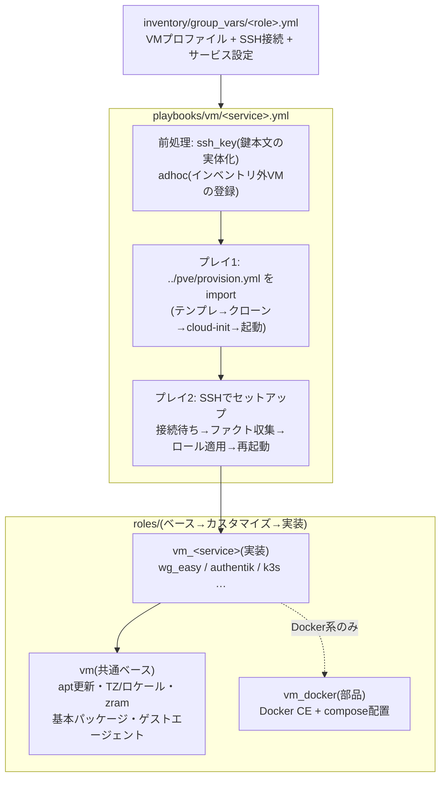
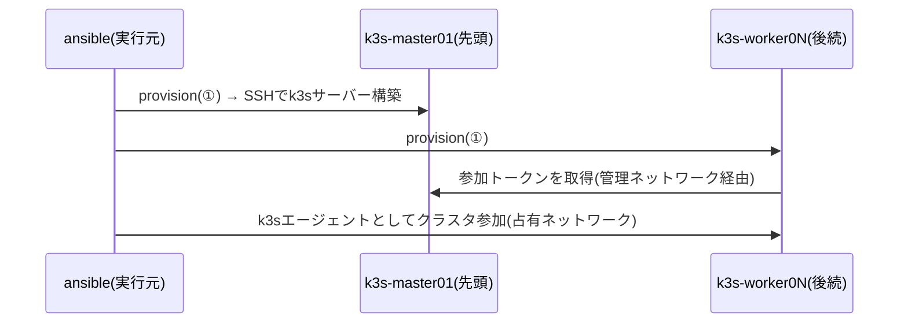

# ② VMセットアップドメイン(vm)

VMの**中身**(OS設定・Docker・サービス)をSSHで収束させるドメイン。1サービス=1playbookで、①pveドメインのprovisionを先頭でimportするため、**インベントリの宣言から稼働中サービスまで一気通貫**で構築できる。

## 全体像



- サービス固有変数の既定値一覧と説明は `roles/vm_<サービス>/defaults/main.yml` が正。このドキュメントには書き写さない
- インベントリに無いVMを変数だけで構築する方法は [docs/adhoc.md](adhoc.md)、AWXから実行する前提は [docs/awx.md](awx.md)

## playbook一覧

| playbook | 構築するもの | 使うvault |
| --- | --- | --- |
| [authentik.yml](../playbooks/vm/authentik.yml) | Authentik(認証基盤) | − |
| [ddns.yml](../playbooks/vm/ddns.yml) | Cloudflare DDNS UI | cloudflare.yml |
| [dev/setup.yml](../playbooks/vm/dev/setup.yml) | 開発VM一式 | − |
| [dev/password.yml](../playbooks/vm/dev/password.yml) | 開発VMのログインパスワードだけ更新 | − |
| [k3s.yml](../playbooks/vm/k3s.yml) | k3sクラスタ(k8sグループ全台) | − |
| [pbs.yml](../playbooks/vm/pbs.yml) | Proxmox Backup Server | − |
| [supabase.yml](../playbooks/vm/supabase.yml) | Supabase | supabase.yml |
| [technitium.yml](../playbooks/vm/technitium.yml) | Technitium DNS | − |
| [wg-easy.yml](../playbooks/vm/wg-easy.yml) | wg-easy(WireGuard VPN) | wg-easy.yml |
| [ssh_key.yml](../playbooks/vm/ssh_key.yml) | 前処理(単体では使わない) | − |

## 共通の動作

全サービスplaybookは同じ流れで動く。

1. **前処理**: 鍵を本文で受け取っていれば一時ファイルへ実体化(ssh_key.yml)。`profile` 指定があればインベントリ外VMを一時登録(adhoc.yml)
2. **①ドメインをimport**: `../pve/provision.yml` でVM自体を収束
3. **SSHセットアップ**: SSH到達を待つ→ファクト収集→`vm_<サービス>` ロールを適用
4. **仕上げ**: 再起動(カーネル更新等がある時のみ。強制は `-e vm_reboot_force=true`、抑止は `-e vm_reboot_after_setup=false`)→実行元からの疎通確認→接続先の表示

よく使う実行時の指定:

```sh
ansible-playbook playbooks/vm/wg-easy.yml                            # グループ全体(通常はこれだけ)
ansible-playbook playbooks/vm/dev/setup.yml -l yuya-dev              # 1台に絞る
ansible-playbook playbooks/vm/wg-easy.yml -e vm_reboot_after_setup=false  # 稼働中サービスの設定だけ直す
```

絞り込みはローカルでは `-l` でよい。ただし**adhoc(インベントリ外VM)とAWXでは `-e target=` を使う**(`-l` は前処理のlocalhostプレイまで除外してしまうため)。

## 各playbookの説明

### authentik.yml

Docker composeでAuthentikを構築する。構築後は `http://<IP>:9000/`(初回セットアップは `/if/flow/initial-setup/`)。ヘルスチェック(`/-/health/ready/`)の応答まで確認してから終わる。

### ddns.yml

WAN IPの変動をCloudflareのAレコードへ追従させる cloudflare-ddns-ui を構築する。ゾーンIDとAPIトークンは `vault/cloudflare.yml` から自動で渡る。更新対象レコードは役割プロファイル(`inventory/group_vars/ddns.yml`)で宣言する。Web UI(既定 :8080)は認証が無いため、待ち受けを絞る設定も用意している(defaultsを参照)。

### dev/setup.yml

開発VMを一式構築する: Cockpit(:9090)+Navigator/Machines/Docker Manager、Docker、kubectl/helm、VSCode Serverの定期掃除。`-e vm_gui_required=true` でXFCEデスクトップ+xrdp(:3389)+ブラウザも入る。

`-e pve_ssh_password=` を渡すと、下のpassword.ymlを内包しているためログインパスワードも同時に設定される。

### dev/password.yml

開発VMのログインパスワード(**CockpitとxrdpのPAM認証**で使う。SSHは公開鍵のまま)だけを更新する。

```sh
ansible-playbook playbooks/vm/dev/password.yml -e target=yuya-dev -e pve_ssh_password=<パスワード>
```

- `pve_ssh_password` を渡したときだけ動く(未指定なら全スキップで `changed=0`)。8文字以上・空白なし。値はログにも `--diff` にも出ない
- 渡しかたに注意: **AWXでは暗号化したSurvey(Password型)で渡す**(Job Templateの変数欄は画面から見えるため)。手元の `-e` はシェル履歴に残るので、使い捨てでないパスワードは履歴に残らない方法で渡す
- **対象は1台まで**。1つのパスワードを複数VMへ配る事故と、広い指定で全VMを電源再投入する事故を防ぐため、2台以上が対象だと実行前に止まる
- **反映にはVMの電源再投入が要る**。cloud-initのドライブはPVEがVMの起動時に作り直すため、ゲスト内の `reboot` では反映されない。playbookが停止→起動まで行う(応答しないゲストは `-e pve_power_force=true`)
- 電源再投入でcloud-initは初回相当の処理をやり直すため、**SSHホスト鍵も作り直される**(このリポジトリは検証しない設計のため影響なし。手元のsshクライアントは警告を出す)
- 最後にSSHで `passwd --status` が `P`(PAMで使える状態)になったことを確認する。値そのものは照合できないため、出力の最終変更日が本日かで見る。SSH鍵が無い実行では確認をスキップし、Cockpitでの確認方法を案内する
- 冪等性の例外(渡したら必ず書き込む)である理由は [docs/pve.md](pve.md#冪等性の設計)

### k3s.yml

k8sグループ全台を順にKubernetesクラスタへ収束させる。クラスタを組むため**順序が意味を持つ**唯一のplaybook。

- **`k8s` グループの先頭ホスト=コントロールプレーン**、以降はワーカーとして参加する
- `order: inventory` + `serial: 1` で宣言順に1台ずつ処理する(ワーカーは先行するコントロールプレーンから参加トークンを取得するため)
- ワーカー追加は「`inventory/hosts.yml` の `k8s` グループ末尾にホストを足して再実行」するだけ



- SSHは管理ネットワーク(172.16.x)、k3s API・ノード間通信は占有ネットワーク(`cluster_ip`)を使う
- 構築後、コントロールプレーンのkubeconfig取得手順が実行結果に表示される

### pbs.yml

Proxmox Backup Serverを構築する。バックアップデータはOSと別のデータディスク(役割プロファイルの `pve_vm_disks` で宣言)に置き、再起動後もマウントされていることまで確認する。構築後は `https://<IP>:8007/`。PVE側への登録手順(データセンター→ストレージ→追加)は実行結果に表示される。バックアップ転送は2枚目NIC(`cluster_ip`)の占有回線を通る。

### supabase.yml

Docker composeでSupabase一式を構築する。ダッシュボードのパスワードは `vault/supabase.yml` から渡る。構築後はAPI/Studioが :8000、Postgresがセッション :5432 / トランザクション :6543。APIキーの確認手順は実行結果に表示される。**`.env` と `volumes/db/data` は対**なので、バックアップは両方まとめて取る。

### technitium.yml

Technitium DNSを構築する。DNS(:53)とWebコンソール(:5380)。ホスト側のstub resolverがポート53を塞いでいる場合は自動で退かせる。LAN内の名前解決(`*.cc-chacchan.com` の内部解決)を担うため、停止すると影響が広い。

### wg-easy.yml

WireGuard VPN(wg-easy)を構築する。OIDC連携と初期パスワードは `vault/wg-easy.yml` から渡る。UI(:51821)とWireGuard本体(UDP :51820。ルーターでこのポートだけ外部へ開ける)。OIDCのリダイレクトURIなど、プロバイダ側に登録する値は実行結果に表示される。

### ssh_key.yml(前処理)

鍵を本文で受け取ったとき(`pve_ssh_prikey_value`)に、SSHが使える0600の一時ファイルへ書き出す部品。各playbookが先頭でimportするため単体では使わない。詳細は次の節。

## サービスの宣言のしかた

役割グループの `inventory/group_vars/<role>.yml` に3種類の変数をまとめる。

```yaml
# inventory/group_vars/wg_easy.yml
# --- ① VMプロファイル(pveドメインが使う) ---
pve_vm_cores: 2
pve_vm_memory: 512
pve_vm_disk_size: 8

# --- ② SSH接続(cloud-initが作るユーザーと鍵) ---
pve_ssh_user: wg
pve_ssh_pubkey_file: ~/.ssh/id_ed25519_wg_easy.pub
pve_ssh_prikey_file: ~/.ssh/id_ed25519_wg_easy

# --- ③ サービス設定(vm_<service>ロールが使う) ---
wg_easy_init_host: wg.example.com
wg_easy_version: "15.4.0-beta.1"
```

- SSH接続は **provisionがcloud-initに書き込んだユーザー・鍵をそのまま使う**ため、宣言が一致していれば必ず入れる
- 秘密情報(APIトークン等)は平文で置かず `vault/` の暗号化ファイルに置く

## 鍵をファイルではなく本文で渡す(AWXのSurveyなど)

AWXのSurveyはファイル入力に対応していない。鍵をパスで置けない実行環境では、**鍵の本文をそのまま入れる変数**を代わりに使う。AWXで動かすときの前提はほかにもある → [docs/awx.md](awx.md)

| ファイルで渡す(既定) | 本文で渡す | 中身 |
| --- | --- | --- |
| `pve_ssh_pubkey_file` | `pve_ssh_pubkey_value` | cloud-initがVMに登録する公開鍵 |
| `pve_ssh_prikey_file` | `pve_ssh_prikey_value` | AnsibleがVMへSSHする秘密鍵 |

**本文が入っていればファイル指定より優先される**ため、`group_vars/<役割>.yml` の宣言は書き換えなくてよい。AWXではSurveyの質問を「テキストエリア」で作り、変数名をこの2つにする(秘密鍵の質問は**暗号化を有効にする**。パスフレーズ付きの鍵は非対話で解錠できないため使えない)。

秘密鍵はSSHがファイルしか受け付けないため、[playbooks/vm/ssh_key.yml](../playbooks/vm/ssh_key.yml) が各playbookの先頭で `~/.ansible/pve_ssh_keys/<鍵のハッシュ>` へ0600で書き出し、接続にはそれを指す `pve_ssh_prikey_resolved` を使う。本文を渡さなければこのプレイは何もしない。

```sh
# コマンドラインから渡すときはJSONで。-e key=value は複数行が1行目で切れる
ansible-playbook playbooks/vm/wg-easy.yml -e @keys.json
```

- 書き出した秘密鍵は実行後も残る。AWXは実行環境コンテナごと破棄されるが、手元で試したときは `~/.ansible/pve_ssh_keys/` を消す
- AWXの **Machine Credential** はこのリポジトリではそのままでは効かない。playbookが `ansible_user` / `ansible_ssh_private_key_file` をplay変数で指定しており、Credentialが渡すコマンドラインオプションより優先されるため

## 設計メモ(なぜこうなっているか)

- **`gather_facts: false` + SSH到達後に明示的な `setup`**: プレイ冒頭の自動ファクト収集は `pre_tasks` の接続待ちより**先に**走るため、作りたてのVMでは必ず失敗する。全playbookで接続待ち→収集の順を明示している
- **ホスト鍵を検証しない**: cloud-init直後はVMのホスト鍵が毎回変わるため `StrictHostKeyChecking=no`。管理ネットワーク内での運用が前提
- **最後に必ず再起動**: dockerグループ追加・カーネル更新の反映のため。`restart: unless-stopped` のコンテナは自動復帰する
- **ロールは接続変数をそのまま使う**: VM内のユーザー名は `ansible_user`、IPは `ansible_host` を参照する(playbookが宣言の `pve_ssh_user` / `ansible_host` から接続を組み立てるため、変数は1系統だけ)

## トラブルシューティング

| 症状 | 原因と対処 |
| --- | --- |
| `SSH接続を待つ` でタイムアウト(既定600秒) | VMが起動しきっていないか、cloud-initのIP設定と `ansible_host` の不一致。PVE UIのコンソールでゲストの状態を確認 |
| `Permission denied (publickey)` | `pve_ssh_user` / 公開鍵と実VMのcloud-init設定がずれている。`playbooks/pve/provision.yml` を流して収束させてから再実行 |
| セットアップ途中で `No route to host` | ゲストのネットワーク断か再起動中。少し待って同じplaybookを再実行(冪等なので途中からやり直せる) |
| k3sワーカーが参加に失敗 | コントロールプレーン(グループ先頭)が未構築のまま後続だけ実行した。グループ全体で `playbooks/vm/k3s.yml` を再実行 |
| Cockpit / xrdp にログインできない | PAM用のログインパスワードが未設定。`playbooks/vm/dev/password.yml -e target=<ホスト> -e pve_ssh_password=<パスワード>` で設定する(SSHは公開鍵なので影響が出ない) |
| 構築は成功したのに最後の疎通確認だけ失敗 | 確認は実行元(AWXなら実行Pod)から行われる。実行元→VMのLAN側IPへの経路・firewallを確認([docs/awx.md](awx.md)) |
