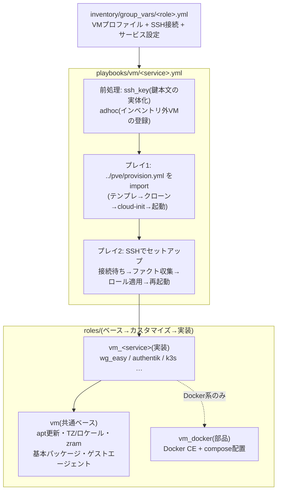

# ② VMセットアップドメイン(vm)

VMの**中身**(OS設定・Docker・サービス)をSSHで収束させるドメイン。1サービス=1playbookで、①pveドメインのprovisionを先頭でimportするため、**インベントリの宣言から稼働中サービスまで一気通貫**で構築できる。

## 全体像



- サービス固有変数の既定値一覧と説明は `roles/vm_<サービス>/defaults/main.yml` が正。各ページの表は主要なものだけを載せている
- インベントリに無いVMを変数だけで構築する方法は [docs/pve/adhoc.md](../pve/adhoc.md)、AWXから実行する前提は [docs/awx/](../utils/awx/README.md)

## playbook一覧(1ページ=1playbook)

| playbook | ドキュメント | 構築するもの | 使うvault |
| --- | --- | --- | --- |
| [authentik.yml](../../playbooks/vm/authentik.yml) | [authentik.md](authentik.md) | Authentik(認証基盤) | − |
| [ddns.yml](../../playbooks/vm/ddns.yml) | [ddns.md](ddns.md) | Cloudflare DDNS UI | cloudflare.yml |
| [dev/setup.yml](../../playbooks/vm/dev/setup.yml) | [dev/setup.md](dev/setup.md) | 開発VM一式 | − |
| [dev/password.yml](../../playbooks/vm/dev/password.yml) | [dev/password.md](dev/password.md) | 開発VMのログインパスワードだけ更新 | proxmox_api.yml |
| [k3s.yml](../../playbooks/vm/k3s.yml) | [k3s.md](k3s.md) | k3sクラスタ(k8sグループ全台) | − |
| [pbs.yml](../../playbooks/vm/pbs.yml) | [pbs.md](pbs.md) | Proxmox Backup Server | − |
| [coolify.yml](../../playbooks/vm/coolify.yml) | [coolify.md](coolify.md) | Coolify(セルフホストPaaS) | なし |
| [rancher.yml](../../playbooks/vm/rancher.yml) | [rancher.md](rancher.md) | Rancher(Kubernetes管理サーバー) | rancher.yml |
| [technitium.yml](../../playbooks/vm/technitium.yml) | [technitium.md](technitium.md) | Technitium DNS | − |
| [wg-easy.yml](../../playbooks/vm/wg-easy.yml) | [wg-easy.md](wg-easy.md) | wg-easy(WireGuard VPN) | wg-easy.yml |
| [ssh_key.yml](../../playbooks/vm/ssh_key.yml) | [ssh_key.md](ssh_key.md) | 前処理(単体では使わない) | − |

## 共通の動作

全サービスplaybookは同じ流れで動く。

1. **前処理**: 鍵を本文で受け取っていれば一時ファイルへ実体化([ssh_key.md](ssh_key.md))。`profile` 指定があればインベントリ外VMを一時登録([adhoc.md](../pve/adhoc.md))
2. **①ドメインをimport**: `../pve/provision.yml` でVM自体を収束
3. **SSHセットアップ**: SSH到達を待つ→ファクト収集→`vm_<サービス>` ロールを適用
4. **仕上げ**: 再起動(カーネル更新等がある時のみ。強制は `-e vm_reboot_force=true`、抑止は `-e vm_reboot_after_setup=false`)→実行元からの疎通確認→接続先の表示

よく使う実行時の指定:

```sh
ansible-playbook playbooks/vm/wg-easy.yml                            # グループ全体(通常はこれだけ)
ansible-playbook playbooks/vm/dev/setup.yml -l yuya-dev              # 1台に絞る
ansible-playbook playbooks/vm/wg-easy.yml -e vm_reboot_after_setup=false  # 稼働中サービスの設定だけ直す
```

絞り込みはローカルでは `-l` でよい。ただし**adhoc(インベントリ外VM)とAWXでは `-e target=` を使う**(`-l` は前処理のlocalhostプレイまで除外してしまうため)。

## 共通の変数(全サービスplaybook)

各ページの変数表では繰り返さない。既定値の正は [inventory/group_vars/](../../inventory/group_vars/) の各役割プロファイル。

| 変数 | 型 | 必須 | 既定値 | 説明 |
| --- | --- | :-: | --- | --- |
| `target` | str | | サービスのグループ名 | 対象の絞り込み(直接実行では新ホスト名) |
| `profile` | str | | なし | 直接実行時の役割グループ([adhoc.md](../pve/adhoc.md)) |
| `pve_ssh_user` | str | ✔ | 役割プロファイル | SSH接続ユーザー(cloud-initが作る) |
| `pve_ssh_prikey_file` | str | | 役割プロファイル | 秘密鍵のパス |
| `pve_ssh_prikey_value` | str | | なし | 秘密鍵の本文(AWX Survey用。ファイルより優先) |
| `vm_ssh_wait_timeout` | int | | `600` | SSH到達待ちの上限(秒) |
| `vm_reboot_after_setup` | bool | | `true` | 仕上げの再起動を行うか |

## サービスの宣言のしかた

役割グループの `inventory/group_vars/<role>.yml` に3種類の変数をまとめる。

```yaml
# inventory/group_vars/wg_easy.yml
# --- ① VMプロファイル(pveドメインが使う) ---
pve_vm_cores: 2
pve_vm_memory: 512
pve_vm_disk_size: 8

# --- ② SSH接続(cloud-initが作るユーザーと鍵) ---
pve_ssh_user: wg
pve_ssh_pubkey_file: ~/.ssh/id_ed25519_wg_easy.pub
pve_ssh_prikey_file: ~/.ssh/id_ed25519_wg_easy

# --- ③ サービス設定(vm_<service>ロールが使う) ---
wg_easy_init_host: wg.example.com
wg_easy_version: "15.4.0"
```

- SSH接続は **provisionがcloud-initに書き込んだユーザー・鍵をそのまま使う**ため、宣言が一致していれば必ず入れる
- 秘密情報(APIトークン等)は平文で置かず `vault/` の暗号化ファイルに置く

## 設計メモ(なぜこうなっているか)

- **`gather_facts: false` + SSH到達後に明示的な `setup`**: プレイ冒頭の自動ファクト収集は `pre_tasks` の接続待ちより**先に**走るため、作りたてのVMでは必ず失敗する。全playbookで接続待ち→収集の順を明示している
- **ホスト鍵を検証しない**: cloud-init直後はVMのホスト鍵が毎回変わるため `StrictHostKeyChecking=no`。管理ネットワーク内での運用が前提
- **最後に必ず再起動**: dockerグループ追加・カーネル更新の反映のため。`restart: unless-stopped` のコンテナは自動復帰する
- **ロールは接続変数をそのまま使う**: VM内のユーザー名は `ansible_user`、IPは `ansible_host` を参照する(playbookが宣言の `pve_ssh_user` / `ansible_host` から接続を組み立てるため、変数は1系統だけ)

## トラブルシューティング(ドメイン共通)

| 症状 | 原因と対処 |
| --- | --- |
| `SSH接続を待つ` でタイムアウト(既定600秒) | VMが起動しきっていないか、cloud-initのIP設定と `ansible_host` の不一致。PVE UIのコンソールでゲストの状態を確認 |
| `Permission denied (publickey)` | `pve_ssh_user` / 公開鍵と実VMのcloud-init設定がずれている。`playbooks/pve/provision.yml` を流して収束させてから再実行 |
| セットアップ途中で `No route to host` | ゲストのネットワーク断か再起動中。少し待って同じplaybookを再実行(冪等なので途中からやり直せる) |
| Cockpit / xrdp にログインできない | PAM用のログインパスワードが未設定。[dev/password.md](dev/password.md) で設定する(SSHは公開鍵なので影響が出ない) |
| `QEMU Guest Agent is not running ... guest-ping failed` | VM設定は `pve_vm_agent: 1` だがゲスト側にエージェントが未導入。`roles/vm` を通していない新規VMで起きる。先に構築playbookを流すか `-e pve_power_force=true` |
| 構築は成功したのに最後の疎通確認だけ失敗 | 確認は実行元(AWXなら実行Pod)から行われる。実行元→VMのLAN側IPへの経路・firewallを確認([docs/awx/](../utils/awx/README.md)) |
