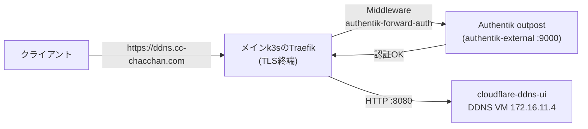

# ddns.yml — Cloudflare DDNS UIを構築する

WAN IPの変動をCloudflareのAレコードへ追従させる cloudflare-ddns-ui をVMごと一気通貫で構築する。ゾーンIDとAPIトークンは [vault/cloudflare.yml](../../vault/cloudflare.yml) から自動で渡る。

## 公開経路(このリポジトリでの扱い)

TLSは**メインクラスタのTraefikで終端**し、Authentikの forwardAuth で認証してからVMの:8080へHTTPで転送する。経路の宣言は [inventory/group_vars/all/k8s.yml](../../inventory/group_vars/all/k8s.yml) の `k8s_external_routes`(`cloudflare-ddns-ui`)。



- 公開範囲: `entrypoints` は `websecure` のみ = **LAN内限定**
- 証明書: `*.cc-chacchan.com` のワイルドカード(cert-manager)でカバーされる
- 認証: Web UI自体に認証が無いため、Ingressに `authentik-forward-auth` Middlewareを付け、`/outpost.goauthentik.io` パスをAuthentikへ向けている(Middlewareは [authentik.md](authentik.md) の経路が生成する)。VMのIPへ直接アクセスすると認証を通らないため、必要なら `cloudflare_ddns_ui_http_bind` で待ち受けを絞る

## 実行方法

```sh
# インベントリ実行(ddnsグループの宣言どおり)
ansible-playbook playbooks/vm/ddns.yml

# 直接実行
ansible-playbook playbooks/vm/ddns.yml \
  -e target=ddns02 -e profile=ddns -e vmid=903 -e node=pve03 -e ip=172.16.11.93
```

## 変数一覧

接続系の共通変数は [README.md](README.md#共通の変数)。全既定値の正は [roles/vm_ddns/defaults/main.yml](../../roles/vm_ddns/defaults/main.yml)。

| 変数 | 型 | 必須 | 既定値 | 説明 |
| --- | --- | :-: | --- | --- |
| `cloudflare_ddns_ui_records` | list | ✔ | 役割プロファイル | 更新対象レコードのFQDN一覧([inventory/group_vars/ddns.yml](../../inventory/group_vars/ddns.yml)で宣言) |
| `cloudflare_ddns_ui_zone_id` | str | ✔ | vault | CloudflareゾーンID(vaultから自動) |
| `cloudflare_ddns_ui_api_token` | str | ✔ | vault | Cloudflare APIトークン(vaultから自動) |
| `cloudflare_ddns_ui_http_port` | int | | `8080` | Web UIポート |
| `cloudflare_ddns_ui_http_bind` | str | | `0.0.0.0` | Web UIの待ち受けアドレス(絞る設定もdefaults参照) |
| `cloudflare_ddns_ui_interval` | int | | `300` | 更新チェック間隔(秒) |

## AWXでの実行

Job Template **`vm-ddns`**(定義: [awx/job_templates.yml](../../awx/job_templates.yml))。Surveyは共通セット。vault値はVault credentialで復号される。

## つまずきやすいポイント

- **Web UIに認証が無い** → 既定で :8080 が開く。LAN外に見せない。待ち受けを絞る設定はdefaultsを参照
- **vaultの値を変えたいとき** → `ansible-vault edit vault/cloudflare.yml`(トークンのスコープはZone.DNS編集のみが正)
- **レコードの追加はインベントリで** → `cloudflare_ddns_ui_records` に足して再実行(冪等)
