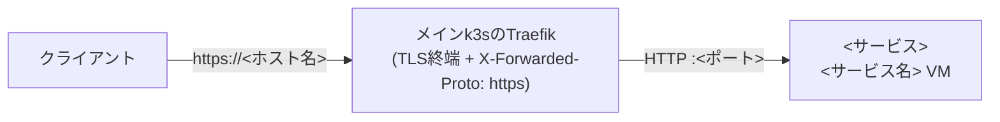

# <playbook名>.yml — <サービス名>(<一言説明>)を構築する

<!--
このディレクトリ(②VMセットアップドメイン)のページはこのテンプレートに従う。
- 1ページ = 1playbook。ファイル名はplaybookと同名(拡張子を .md に置き換える)
- `##` 見出しは下記の名称・順序のまま使う。該当しない節だけ丸ごと削除し、固有の話題は該当する `##` の下に `###` で書く
- 文章もコメントも「説明」だけを書く。判断の経緯・変更の過程は書かない
- 変数の既定値の正は roles/<ロール名>/defaults/main.yml。表には主要なものだけ載せる
- 新規追加時は docs/vm/README.md のplaybook一覧にも1行足す
-->

<概要。2〜4文で「何を構築するか」「配布形態や前提」「このリポジトリでの扱い」を書く。>

## 公開経路(このリポジトリでの扱い)

<!-- inventory/group_vars/all/k8s.yml の k8s_external_routes に宣言があるサービスは必ず書く。公開しないサービスは節ごと削除する -->

<TLS終端の位置と転送先。`k8s_external_routes` の宣言先に触れる。>



- 公開範囲(`entrypoints` が `websecure` だけならLAN内限定)
- 証明書の扱い
- VM側で公開URLに合わせて収束させる設定があれば表にする

## 実行方法

```sh
# インベントリ実行(<グループ名>グループの宣言どおり)
ansible-playbook playbooks/vm/<playbook名>.yml

# 直接実行(インベントリ外に検証用をもう1台)
ansible-playbook playbooks/vm/<playbook名>.yml \
  -e target=<新ホスト名> -e profile=<役割> -e vmid=<VMID> -e node=<ノード> -e ip=<IP>
```

構築後の初期設定(AnsibleではなくサービスUI側で1回):

1. <手順>
2. <手順>

## 変数一覧

接続系の共通変数は [README.md](README.md#共通の変数)。全既定値の正は [roles/vm_<サービス>/defaults/main.yml](../../roles/vm_<サービス>/defaults/main.yml)。

| 変数 | 型 | 必須 | 既定値 | 説明 |
| --- | --- | :-: | --- | --- |
| `<サービス>_version` | str | | `<版>` | <説明> |
| `<変数>` | <型> | | `<既定値>` | <説明> |

## 冪等性・更新

<!-- 再実行時に何が起きるか。該当しなければ削除する -->

- 更新のしかた(バージョン変数を上げて再実行、など)
- 再実行しても壊れないもの(データの永続先)
- 再実行でも `changed` になりうるもの

## AWXでの実行

Job Template **`vm-<サービス>`**(定義: [awx/job_templates.yml](../../awx/job_templates.yml))。Surveyは共通セット<+ 固有の質問>。<秘密情報の渡しかた>

## つまずきやすいポイント

- **<症状>** → <原因と対処>
- **<症状>** → <原因と対処>
