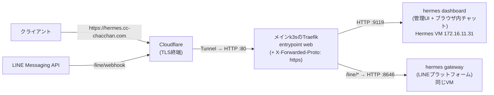
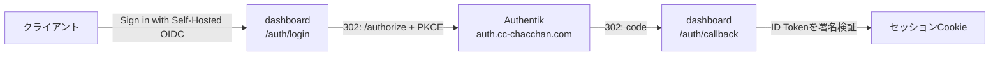

# hermes.yml — Hermes Agent(セルフホストAIエージェント)を構築する

Nous Researchの[Hermes Agent](https://hermes-agent.nousresearch.com/)を専用VMごと一気通貫で構築する。配布形態はPython(uvの仮想環境)+ gitチェックアウトのため、**版はupstreamのリリースタグで固定**し、タグ→コミットSHAを解決して公式インストーラの `--commit` へ渡す(`--non-interactive --skip-setup` で対話ウィザードは動かさない)。ヘッドレスVMなのでブラウザ自動操作(Playwright/Chromium)とComputer Useは既定で入れない。LLM推論はこのVMで行わず、外部のOpenAI互換API・Gemini等へ接続する前提。

常駐させるのは**web dashboard**(管理UI + ブラウザ内チャット)で、これをTraefikで公開する。上流にはdashboardをサービス化するコマンドが無いため、systemd unitはこのロールが持つ。メッセージングGateway(Telegram/Discord等)は上流の `hermes gateway install --system` に任せ、**既定では常駐させない**(チャネルを1つも設定していない状態で常駐させても意味がないため)。エージェントの実行環境としてDocker(`terminal.backend: docker` 用)と `ansible-core` / kubectl / Helm を入れる。kubectl・Helmの導入は `roles/vm` の共通タスクで、`vm_dev` と同じ手順を共有する。

## 役割分担(Ansible / Hermes / PBS)

| 誰が | 何を持つか |
| --- | --- |
| Ansible | 再構築できる基盤と初期状態: VM・cloud-init・OS設定・専用ユーザー・**Hermes本体の版**・systemd・Docker・運用ツール・dashboardの待受と認証(SSO含む)・公開URL |
| Hermes(dashboard / CLI) | 実運用設定: モデルとプロバイダの認証情報・ツール・チャネル・スキル・メモリ・セッション(実体はVM上の `~/.hermes/`) |
| PBS | VM全体と実運用状態のバックアップ |

Ansibleは `HERMES_HOME`(`~/.hermes/`)配下の `config.yaml` / `.env` / 状態ファイルを**上書きしない**。例外は公開経路と対になる2つのキー(`dashboard.public_url` / `dashboard.trusted_proxies`)だけで、それ以外はHermes側の持ち物。

## 公開経路(このリポジトリでの扱い)

`hermes.cc-chacchan.com` は**Cloudflare Tunnelで公開**している。DNSはこのホスト名だけTunnel向けの個別レコードを持ち、ワイルドカード `*.cc-chacchan.com` → 172.16.12.11 より優先されるため、**宅内からのアクセスもTunnel経由**になる。TLSはCloudflareのエッジで終端し、TunnelからTraefikの `web`(HTTP :80)へ入る。VMの:9119へはHTTPで転送し、`forwarded_https` Middlewareで X-Forwarded-Proto: https を付ける。ブラウザ内チャットはWebSocket(`/api/ws`・`/api/pty`)だが、TraefikがUpgradeをそのまま通すため追加設定は不要。



- Ingressは管理UI(`/`)・LINE(`/line/*`)とも **`entrypoints: web,websecure`**。`web` を落とすとTunnel経由の到達先が無くなり、ホスト名でのアクセスがすべて404になる(`websecure` はLAN内から直接k3sノードを叩く経路用)
- 管理UIもインターネットから到達する。**認証はHermes側**(Authentik SSO / パスワード)が担う。前段にAuthentikのforwardAuthを置くなら、`web` 用のIngressを分けて `middlewares: [authentik-forward-auth]` と `/outpost.goauthentik.io` の経路を足す(ddnsの実例)
- **`/line` プレフィックスは剥がさない**。上流のLINEプラットフォームが `:8646` で `/line/webhook`(POST)・`/line/webhook/health`(GET)・`/line/media/…`(メディア配信)をそのまま待ち受けるため。Traefikはルールが長いほうを優先するので、`/line/*` は管理UI(`/`)より先に一致する
- 証明書: `hermes.cc-chacchan.com` は既存の `*.cc-chacchan.com` SANでカバー済み(Certificate変更不要)
- 認証はAuthentikのSSO(下記)と同梱のusername/passwordプロバイダの併用。**非loopback待受ではプロバイダが1つも無いとdashboardは起動しない**(上流仕様)。ユーザー名は `hermes_dashboard_username`(既定 `admin`)、パスワードと署名鍵は `vault/hermes.yml`(確認は `ansible-vault view vault/hermes.yml`)
- 認証設定は `config.yaml` に置かず、systemdの環境ファイル `/etc/hermes/dashboard.env`(root所有・`hermes` グループのみ読める)から渡す。`~/.hermes/.env` はHermes自身が書き換えるためAnsibleは触らない
- VM側は公開URL(`hermes_public_url`)に合わせて2つの設定を収束させる:

| 設定キー | 値 | 理由 |
| --- | --- | --- |
| `dashboard.public_url` | 公開URL | このホスト名が **HostヘッダとWebSocket Originの許可値**になる(DNSリバインディング対策の照合先)。Cookieとコールバックの基準にもなる |
| `dashboard.trusted_proxies` | `172.16.12.0/24` | X-Forwarded-Proto/For を信頼する上流=k3sノード。これが無いとhttps判定が効かずCookieのsecure属性が落ちる |

- さらに絞る場合: Ingressに `middlewares: [authentik-forward-auth]` を足してAuthentik認証を前段に置く(ddnsの実例)、または `hermes_public_url: ""` + `hermes_dashboard_host: 127.0.0.1` にしてSSHトンネル経由だけにする(上流推奨)

## SSO(Authentik OIDC)

ログインは上流同梱の**self-hosted OIDCプラグイン**でAuthentikへ委譲できる(認可コード + PKCE(S256)。受け取ったID Tokenを `jwks` で署名検証し `iss` / `aud` を照合する)。`hermes_oidc_issuer` と `hermes_oidc_client_id` の**両方**を宣言したときだけ有効になる(片方だけだとプラグインは黙って登録を諦めるため、playbookが先に止める)。



- 設定は `/etc/hermes/dashboard.env` の `HERMES_DASHBOARD_OIDC_*` から渡す。**環境変数はHermesの `config.yaml` より優先される**(上流仕様)ため、`config.yaml` には書かない
- IdP側に登録するリダイレクトURIは **`<hermes_public_url>/auth/callback`**。`hermes_public_url` が空のときはリクエストのHost(IP直打ち)が基準になる
- **Authentik側の設定はこのリポジトリの管理外**(Authentik UIで1回。ユーザー作成だけは [utils/authentik/users.md](../utils/authentik/users.md) にある):
  - OAuth2/OpenID ProviderのRedirect URIsに `https://hermes.cc-chacchan.com/auth/callback` を登録する(Strict match。**未登録だとAuthentikが400を返す**)
  - client typeは **public**(PKCEのみ)。confidentialにする場合は `vault/hermes.yml` に `vault_hermes_oidc_client_secret` を追加する(playbookが `hermes_oidc_client_secret` へ渡す)
  - スコープは `openid profile email`(`sub` / `email` / `name` をセッションの識別情報に使う)
- ⚠ **誰がログインできるかはAuthentik側でしか絞れない**。Hermesは認証が通った利用者を区別せず、エージェント(sudo・docker権限つき)をそのまま操作できる。Authentikのアプリケーションにポリシー/グループのバインドを設定する
- 同梱のusername/passwordゲートは**IdPが落ちたときの退避経路として併用**する(ログイン画面にパスワード欄とSSOボタンが並ぶ)。SSOだけにするなら `hermes_dashboard_enable_basic_auth: false`

## 実行方法

```sh
# インベントリ実行(hermesグループの宣言どおり)
ansible-playbook playbooks/vm/hermes.yml

# 経路の反映(メインクラスタのTraefikルート)
ansible-playbook playbooks/k8s/deploy.yml -e app=external

# 版を上げる(=意図した更新。既定値は roles/vm_hermes/defaults/main.yml)
ansible-playbook playbooks/vm/hermes.yml -e hermes_version=v2026.9.7
```

構築後の初期設定(AnsibleではなくHermes側で1回):

1. `https://hermes.cc-chacchan.com/` を開き、**Sign in with Self-Hosted OIDC**(Authentik)か `admin` + Vaultのパスワードでログインする(初回起動はWeb UIのビルドが走るため数分かかることがある)
2. モデルとプロバイダの認証情報を設定する。SSHからなら `hermes setup --portal`(Nous Portal)/ `hermes model` / `hermes tools`
3. Agent Sandboxを使うなら `hermes config set terminal.backend docker`(Dockerは導入済み)
4. メッセージングを使うなら `hermes gateway setup` で設定し、`hermes_enable_gateway: true` にしてplaybookを再実行する(systemサービスとして常駐する)

## 変数一覧(サービス固有の主要なもの)

接続系の共通変数は [README.md](README.md#共通の変数全サービスplaybook)。全既定値の正は [roles/vm_hermes/defaults/main.yml](../../roles/vm_hermes/defaults/main.yml)。

| 変数 | 型 | 必須 | 既定値 | 説明 |
| --- | --- | :-: | --- | --- |
| `hermes_version` | str | | `v2026.8.31` | 固定するリリースタグ。`main` 追従は受け付けない(値を変えて再実行=更新) |
| `hermes_dashboard_host` / `_port` | str / int | | `0.0.0.0` / `9119` | dashboardの待受。Traefikが別ホストから来るためloopbackでは受けられない |
| `hermes_dashboard_username` | str | | `admin` | dashboardのログインユーザー名 |
| `hermes_dashboard_password` / `_secret` | str | ✔ | なし | パスワード(16文字以上)とセッション署名鍵(32文字以上)。playbookが `vault_hermes_dashboard_*` から渡す |
| `hermes_dashboard_enable_basic_auth` | bool | | `true` | username/passwordゲートを使うか。`false` にするならSSOの宣言が必須 |
| `hermes_oidc_issuer` / `_client_id` | str | | Authentikの `hermes-agent`(group_vars) | SSOのissuer識別子とclient ID。**両方そろって初めて有効**になる |
| `hermes_oidc_scopes` | str | | `openid profile email` | 要求するスコープ(空白区切り。`openid` は必須) |
| `hermes_oidc_client_secret` | str | | なし | confidential clientのときだけ設定する。playbookが `vault_hermes_oidc_client_secret` から渡す |
| `hermes_public_url` | str | | `https://hermes.{{ k8s_domain }}`(group_vars) | 公開URL。空にすると公開向けの設定を書かない |
| `hermes_trusted_proxies` | list | | `["172.16.12.0/24"]`(group_vars) | X-Forwarded-* を信頼する上流のCIDR |
| `hermes_enable_gateway` | bool | | `false` | メッセージングGatewayをsystemサービスとして常駐させるか |
| `hermes_line_webhook_port` | int | | `8646` | LINEのwebhook待受ポート。ufwの開放と `k8s_external_routes` の転送先の宣言に使う |
| `hermes_skip_browser` / `_skip_computer_use` | bool | | `true` / `true` | ヘッドレス前提で省く重い依存(Chromium・cua-driver) |
| `hermes_install_docker` / `_install_agent_tools` | bool | | `true` / `true` | Docker(Agent Sandbox)と運用ツール(ansible-core / kubectl / Helm) |
| `hermes_min_free_disk_gb` | int | | `20` | 事前チェックの必要空き容量 |

## 冪等性・更新

- 版の判定は「宣言タグのコミットSHA」と「チェックアウトのHEAD」の比較。一致していればインストーラを実行しない
- 更新は `hermes_version` を変えて再実行する。**`hermes update` やdashboardのUpdateボタンは `main` へ進めてしまう**ため使わない(使った場合、次回のAnsible実行で宣言タグへ引き戻される)
- dashboardの公開設定(`public_url` / `trusted_proxies`)は `hermes config get` の現在値と比べ、差分があるときだけ書き込む
- サービスの再起動は unit・認証情報・本体の版・公開設定のいずれかが変わったときだけ(差分が無ければ何もしない)
- 再実行でも `changed` になりうるのは、OS更新(`apt upgrade safe`。全VM共通)・kubectl(共通タスクが最新安定版を追う)・カーネル更新後の再起動

## AWXでの実行

Job Template **`vm-hermes`**(定義: [awx/job_templates.yml](../../awx/job_templates.yml))。Surveyは共通セット + 版(任意)+ Gateway常駐の有無(任意)。dashboardの認証情報はVault credentialで復号する `vault/hermes.yml` から渡るため、Surveyには出さない。

## つまずきやすいポイント

- **`https://hermes.cc-chacchan.com` が `404 page not found`(Traefikの応答)** → Tunnel経由で entrypoint `web` に入っているのに、Ingressが `websecure` しか許可していない。`kubectl -n platform get ingress hermes -o jsonpath='{.metadata.annotations.traefik\.ingress\.kubernetes\.io/router\.entrypoints}'` で `web,websecure` になっているか確認し、`deploy.yml -e app=external` で反映する
- **`https://hermes.cc-chacchan.com` に到達できない** → 経路の反映(`deploy.yml -e app=external`)を確認。VM単体の生存確認は `curl -s http://172.16.11.31:9119/api/status`(応答があれば外側の問題)
- **ログイン画面が出ずセッショントークンを求められる** → 認証プロバイダが読み込まれていない。`curl -s http://172.16.11.31:9119/api/status` の `auth_required` と `auth_providers`(`basic` / `self-hosted` が入るか)を見る。`/etc/hermes/dashboard.env` とサービスのログを確認
- **SSOボタンを押すとAuthentikが400 `The request fails due to a missing, invalid, or mismatching redirection URI`** → プロバイダのRedirect URIsに `https://hermes.cc-chacchan.com/auth/callback` が未登録。Authentik UIで追加する(Hermes側は再実行不要)
- **Authentikから戻ったところで `invalid_client`** → プロバイダのclient typeがconfidential。`vault/hermes.yml` に `vault_hermes_oidc_client_secret` を追加して再実行するか、Authentik側をpublicに変える
- **SSOボタンが出ない** → `hermes_oidc_issuer` / `hermes_oidc_client_id` の片方しか宣言していない(playbookが止める)、または `/auth/login?provider=self-hosted` が503(VMからIdPへ到達できない・issuerがdiscoveryの値と不一致)。`curl -s https://auth.cc-chacchan.com/application/o/hermes-agent/.well-known/openid-configuration` をVM上で確認する
- **再起動するたびにログアウトされる** → 署名鍵(`vault_hermes_dashboard_secret`)が渡っていない。Vaultの値と環境ファイルを確認する
- **初回起動直後だけ502/接続できない** → dashboardが初回にWeb UI(npm)をビルドしている。`sudo journalctl -u hermes-dashboard -f` で進行を確認する(playbookは既定で最大10分待つ)
- **版を変えたのに更新されない** → 指定タグがupstreamに存在しない、または既にそのコミット。タグ一覧は [releases](https://github.com/NousResearch/hermes-agent/tags)、`-e hermes_version=<タグ>` で明示する
- **LINEのwebhookが届かない(LINE Developersの「検証」が失敗する)** → 順に確認する: ①Gatewayが動いているか(`curl -s http://172.16.11.31:9119/api/status` の `gateway_running`)②`hermes gateway setup` でLINEを設定したか ③経路が反映済みか(LAN内から `curl -i https://hermes.cc-chacchan.com/line/webhook/health` が200。未反映なら `deploy.yml -e app=external`)④Cloudflare側のTunnel経路に `hermes.cc-chacchan.com` があるか(宅外からの到達はここで決まる)
- **Gatewayを二重に起動しない** → dashboardのUIから起動したGateway(dashboardプロセスの子)と `hermes_enable_gateway: true` のsystemd unitは、同じ:8646を掴むため同時に動かせない。前者はunitが無いぶんVM再起動後の復帰がHermes側の挙動任せになるので、常駐させるならsystemd側(`hermes_enable_gateway: true`)に寄せる
- **Gatewayが起動しない/落ち続ける** → チャネル未設定のまま常駐させていないか(`hermes_enable_gateway: false` に戻し、`hermes gateway setup` を先に済ませる)。ログは `sudo journalctl -u hermes-gateway -f`
- **エージェントは強い権限を持つ** → `hermes` ユーザーは `sudo` と `docker` グループに属する。専用VM・LAN内限定が前提の構成のため、公開範囲を広げるときは権限設計から見直す
