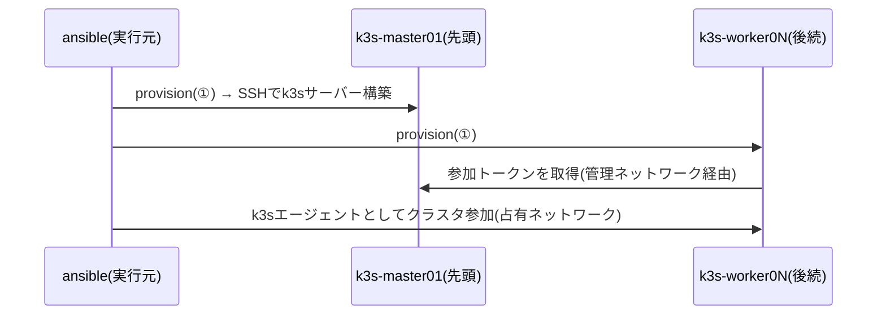

# k3s.yml — k3sクラスタを構築する

k8sグループ全台を順にKubernetesクラスタへ収束させる。クラスタを組むため**順序が意味を持つ**唯一のplaybook。

- **`k8s` グループの先頭ホスト=コントロールプレーン**、以降はワーカーとして参加する(`k3s_role` の明示があればそちらを優先)
- `order: inventory` + `serial: 1` で宣言順に1台ずつ処理する(ワーカーは先行するコントロールプレーンから参加トークンを取得するため)



- SSHは管理ネットワーク(172.16.x)、k3s API・ノード間通信は占有ネットワーク(`cluster_ip`)を使う
- 構築後、コントロールプレーンのkubeconfig取得手順が実行結果に表示される

## 実行方法

```sh
# インベントリ実行(k8sグループ全台。ワーカー追加もhosts.ymlに足して再実行するだけ)
ansible-playbook playbooks/vm/k3s.yml

# 直接実行(ワーカーを1台だけ追加。参加先はインベントリの宣言から自動解決)
ansible-playbook playbooks/vm/k3s.yml \
  -e target=k3s-worker05 -e profile=k8s \
  -e vmid=1001 -e node=pve10 -e ip=172.16.12.19 -e ip2=10.10.20.19/24
```

## 変数一覧

接続系の共通変数は [README.md](README.md#共通の変数)。全既定値の正は [roles/vm_k3s/defaults/main.yml](../../roles/vm_k3s/defaults/main.yml) と [inventory/group_vars/k8s.yml](../../inventory/group_vars/k8s.yml)。

| 変数 | 型 | 必須 | 既定値 | 説明 |
| --- | --- | :-: | --- | --- |
| `k3s_role` | str | | 先頭=server / 他=agent | ノード役割の明示(`server` / `agent`)。hosts.ymlのホスト変数か `-e` |
| `cluster_ip` | str | ✔ | hosts.yml | 占有ネットワークのCIDR(直接実行では `-e ip2=`) |
| `kubernetes_version` | str | | group_vars/k8s.yml | k3sバージョン(クラスタ内で揃える。更新はgroup_varsを上げてから順に再構築) |
| `kubernetes_server_ip` | str | △ | 宣言から自動導出 | コントロールプレーンの管理IP。**k8sグループが届かない実行では `-e` で必須** |
| `kubernetes_server_ssh_user` | str | △ | 同上 | コントロールプレーンのSSHユーザー(同上) |
| `kubernetes_server_ssh_prikey` | str | | 接続に使う鍵と同じ | コントロールプレーンの秘密鍵(実行環境上のファイルパス)。別の鍵でしか入れないときだけ指定する |
| `kubernetes_server_port` | int | | `6443` | APIサーバーポート(config.yamlの `https-listen-port` にも入る) |
| `kubernetes_allow_downgrade` | bool | | `false` | 導入済みより古い版の宣言を許すか(既定では失敗して止まる) |
| `kubernetes_node_labels` / `kubernetes_node_taints` | list | | `[]` | ノードのラベル/taint |

△: インベントリのk8sグループがある実行では自動導出。無い実行(AWX手動インベントリ等)では実行前検証が不足名を列挙して止まり、`-e` での指定を案内する。

## AWXでの実行

Job Template **`vm-k3s`**(定義: [awx/job_templates.yml](../../awx/job_templates.yml))。Surveyは共通セット+k3s固有の質問(`k3s_role` / `kubernetes_server_ip` / `kubernetes_server_ssh_user`)。

- インベントリをProjectから同期していれば、固有の質問は未回答でよい(宣言から自動解決)
- コントロールプレーンへの接続鍵は共通Surveyの `pve_ssh_prikey_value` をそのまま使う(別の鍵を渡す経路は無い)
- **初回のクラスタ構築は宣言順に依存する**。AWX生成インベントリの並びがコントロールプレーン先頭でない場合、ワーカーがトークン取得に失敗する(現在のホスト名は `k3s-master01` がどう並べても先頭になるため顕在化しない)

## つまずきやすいポイント

- **ワーカーが参加に失敗する** → コントロールプレーン(グループ先頭)が未構築のまま後続だけ実行した。グループ全体で再実行する
- **`kubernetes_server_ip ... が解決できません` で止まる** → インベントリのk8sグループが届いていない実行。メッセージどおり `-e k3s_role=` と `kubernetes_server_*` を渡すか、インベントリを同期する
- **バージョンずれ** → `kubernetes_version` は宣言で固定している(stableチャネル任せにしない)。新ノードだけ新しくならないよう、更新はgroup_varsで版を上げてから全台順に再構築
- **`より古い版です` で止まる** → 導入済みより低い `kubernetes_version` を宣言した。宣言を直すか、意図した操作なら `-e kubernetes_allow_downgrade=true`
- **クラスタ構築後のアプリ配備は③ドメイン** → [docs/k8s/deploy.md](../k8s/deploy.md)
