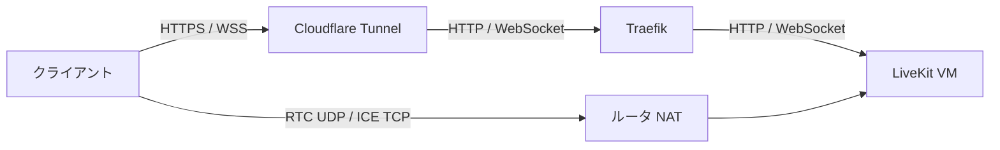

# livekit.yml — LiveKit Server(音声・映像配信基盤)を構築する

Debian 13の専用VMにDocker ComposeでLiveKit Serverを構築する。VM・cloud-init・Dockerは共通ロールを使い、単一コンテナをhost networkで動かす。APIキーペアはAnsible Vaultに永続化し、アプリごとのキー追加にも対応する。Redis・TURNは初期構成に含めない。

## 公開経路(このリポジトリでの扱い)

`wss://livekit.cc-chacchan.com` をクライアントのServer URLとして指定する。HTTP APIも同じホスト名のHTTPSで利用する。WebRTCの接続先はsignaling後のICE Candidateで決まり、WebクライアントにVMの内部IPを指定する必要はない。

[外部ルート宣言](../../inventory/group_vars/all/k8s.yml)の `k8s_external_routes` からService・EndpointSlice・Ingressを生成する。TraefikはHTTP/WebSocketをVMへ転送し、LANのHTTPSは既存のワイルドカード証明書で終端する。Internet側は既存設計どおりCloudflare Tunnelを利用し、CloudflareでTLSを終端してTraefikの `web` entrypointへ接続する。WebSocketに専用の認証Middlewareは付けず、LiveKitのJWTで認証する。



### 公開前のネットワーク設定

Tunnelの公開ホスト登録とルータはこのリポジトリの管理対象外。[ネットワーク構成](../../infrastructure.md)に従い、次を用意する。Ingressの適用だけでは外部の音声・映像通信は成立しない。

| 経路 | 設定 |
| --- | --- |
| Internet HTTPS / WSS | Cloudflare Tunnelで `livekit.cc-chacchan.com` を既存TraefikのHTTP originへ登録し、Hostを維持する。WebSocketを許可する |
| Traefik → VM | `livekit_http_port` のTCPを許可する。Ingressの `ports` と一致させる |
| Internet → VM UDP | `livekit_rtc_udp_start` ～ `livekit_rtc_udp_end` を同一番号のまま `livekit01` のIPへNAT転送する |
| Internet → VM TCP | `livekit_rtc_tcp_port` を同一番号のまま `livekit01` のIPへNAT転送する。HTTPプロキシやTLS終端を挟まない |
| VM → Internet | STUNによる外部IP検出、DNS、HTTPSによるパッケージ・イメージ取得を許可する |

APIポートはInternetへ直接NAT転送しない。RTCはCloudflare TunnelやTraefikを経由しない。外部IPの検出はNAT転送を自動設定する機能ではなく、到達可能なPublic IPv4と転送設定が必要。CGNATや上流ルータがある場合は、その経路も確認する。

UFWはSSHの管理LAN許可後に有効化し、受信を既定拒否にする。Signalingは `livekit_signaling_cidrs`、SSHは `livekit_management_cidr` に制限し、RTCだけ送信元を限定せず許可する。k3sのPod CIDRや管理端末のネットワークが異なる場合は適用前に上書きする。host networkのため、コンテナの待受にもUFWのINPUTルールが適用される。

### UDP mux・NAT・拡張

[固定版の公式設定サンプル](https://github.com/livekit/livekit/blob/v1.13.6/config-sample.yaml)はUDP muxにvCPU数以上のポートを推奨する。8 vCPU向けに8ポートを割り当て、`rtc.udp_port` に範囲文字列を渡す。従来の `rtc.port_range_start` / `rtc.port_range_end` は出力しない。[公式デプロイガイド](https://docs.livekit.io/transport/self-hosting/deployment/)に従いDockerはhost networkを使用する。

`rtc.use_external_ip` でSTUNによるPublic IP検出を行い、Public IPはコードに保存しない。LAN内クライアント用に内部Candidateも広告する。RTCのインターフェースはVMのデフォルト経路のNICに限定する。NATループバックがない環境で外部IPの自己検証だけが失敗する場合は、NAT転送を確認してから `livekit_skip_external_ip_validation` を有効化する。

ICE/TCPはUDPを利用できないクライアント用のfallback。TCPも制限されるネットワークでは接続を保証しない。将来TURNが必要になった場合は、同じLiveKit設定テンプレートへ内蔵TURNを追加できる。TURN/TLSには専用DNS名と有効な証明書・秘密鍵、通常TCP 443の直接到達経路が必要で、TURN/UDPを併用するならそのポートもNATとUFWへ追加する。HTTPのCloudflare TunnelではTURNを運べない。[公式ポート一覧](https://docs.livekit.io/transport/self-hosting/ports-firewall/)に沿ってネットワークと証明書管理を確定してから有効化する。Redisは複数LiveKitノードへ拡張するときに追加する。

## 実行方法

接続用SSH鍵をプロファイルのパスに用意し、Vault passwordを実行環境へ供給する。鍵本文を渡す場合は共通SurveyまたはJSONのextra varsを使う。

```sh
# インベントリ実行
ansible-playbook playbooks/vm/livekit.yml

# 直接実行(インベントリ外の検証VM)
ansible-playbook playbooks/vm/livekit.yml \
  -e target=tmp01 -e profile=livekit -e vmid=799 -e node=pve07 -e ip=172.16.11.99

# 公開ルートの差分確認と適用
ansible-playbook playbooks/k8s/deploy.yml -e app=external --check --diff
ansible-playbook playbooks/k8s/deploy.yml -e app=external
```

直接実行では検証VMを作成し、公開ルートの転送先はインベントリの `livekit01` を維持する。`app=external` は既存の外部ルート全体を収束させるため、差分を確認する。

APIキーペアは [vault/livekit.yml](../../vault/livekit.yml) の `vault_livekit_api_keys` 辞書で管理する。追加・更新は `ansible-vault edit vault/livekit.yml` を使用し、32文字以上のランダムなSecretを設定する。アプリのバックエンドだけにキーペアを供給して参加者JWTを発行し、ブラウザへ渡すのはServer URLと必要な権限・有効期限を持つJWTだけにする。VMの再構築では同じVaultを再利用する。

## 変数一覧

接続系の共通変数は [README.md](README.md#共通の変数)。全既定値の正は [roles/vm_livekit/defaults/main.yml](../../roles/vm_livekit/defaults/main.yml)。VMの資源は [プロファイル](../../inventory/group_vars/livekit.yml)、個体情報は [inventory](../../inventory/hosts.yml)で管理する。

| 変数 | 型 | 説明 |
| --- | --- | --- |
| `livekit_image` / `livekit_version` | str | 公式コンテナと固定バージョン |
| `livekit_install_dir` / `livekit_config_file` | str | Composeと設定ファイルの配置先 |
| `livekit_http_port` | int | HTTP API / signaling。変更時は外部ルートのportも合わせる |
| `livekit_rtc_udp_start` / `livekit_rtc_udp_end` | int | UDP muxの開始・終了ポート。変更時はNATも合わせる |
| `livekit_rtc_tcp_port` | int | ICE/TCP fallback。変更時はNATも合わせる |
| `livekit_use_external_ip` | bool | STUNによる外部IP検出 |
| `livekit_advertise_internal_ip` | bool | LAN用Candidateの広告 |
| `livekit_skip_external_ip_validation` | bool | NAT環境の外部IP自己検証を省略 |
| `livekit_rtc_interfaces` | list | RTCで使うNIC |
| `livekit_signaling_cidrs` / `livekit_management_cidr` | list / str | Signaling / SSHの接続元 |
| `livekit_api_keys` | dict | Vaultから渡すAPI Key → Secretの辞書 |
| `livekit_domain` | str | 接続先の案内用。変更時は外部ルートとTunnelも合わせる |

## 冪等性・更新

設定ファイルはroot所有の0600で配置し、差分出力とタスクログへ秘密情報を出さない。設定またはComposeが変わった場合だけ共通Composeタスクでコンテナを再作成する。Dockerサービスとコンテナのrestart policyでVM再起動後も起動する。バージョン更新は `livekit_version` を変更して再実行する。再起動・再作成では通話が切断されるため利用時間帯を考慮する。

UFWの許可は追加方式。ポートや許可CIDRを変更した場合は、不要になった旧許可ルールとルータの転送も削除する。VMの再構築では宣言済みの許可だけを作成する。

## AWXでの実行

Job Template **`vm-livekit`**(定義: [awx/job_templates.yml](../../awx/job_templates.yml))。Surveyは共通セットを使用する。Vault credentialから共通Vault passwordを供給し、SSH鍵は共通Surveyまたは実行環境のファイルで渡す。

## つまずきやすいポイント

- **WSSは接続するが音声・映像が流れない** → UDP mux全ポートのNAT転送・UFW・広告された外部IPを確認する。
- **LAN内だけ接続できない** → 内部Candidate、LAN間のルーティング、NATループバックを確認する。
- **公開URLへ到達できない** → Tunnelのホスト登録、DNS、TraefikのIngress、VMへのHTTP到達を順に確認する。
- **冪等性とメディア疎通の確認** → 同じPlaybookを再実行して `changed=0` を確認する。異なる外部ネットワークの2クライアントでJWTによる入室と双方向の音声・映像を確認し、UDPを制限したクライアントではICE/TCPの候補選択を確認する。HTTPの起動確認だけではメディア疎通を検証できない。
