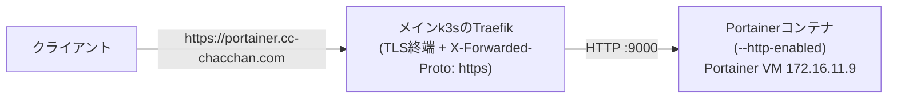

# portainer.yml — Portainer(DockerのWeb UI管理)を構築する

Portainer Business EditionをVMごと一気通貫で構築する。用途は**このVMのDocker単体管理に限定**し、Kubernetesクラスタ管理はRancher([rancher.md](rancher.md))の担当とする。

構成はwg-easyと同じ「`vm_docker`でDocker導入 → composeテンプレート配置 → `docker_compose_v2`で起動」パターン。Portainer経由でデプロイするコンテナもこのVMに同居する。

## 公開経路(このリポジトリでの扱い)

TLSは**メインクラスタのTraefikで終端**し、VMの:9000へHTTPで転送する(Coolify・Rancherと同じ`k8s_external_routes`方式)。Portainerの既定待受はHTTPS(:9443)のため、`--http-enabled` フラグでHTTP待受(:9000)を有効化し、:9443は公開しない。



- 公開範囲は**LAN内限定**(Cloudflare Tunnelの経路には載せない)
- 証明書: `portainer.cc-chacchan.com` は既存の `*.cc-chacchan.com` SANでカバー済み(Certificate変更不要)

## 実行方法

```sh
# インベントリ実行(portainerグループの宣言どおり)
ansible-playbook playbooks/vm/portainer.yml

# 経路の反映(メインクラスタのTraefikルート)
ansible-playbook playbooks/k8s/deploy.yml -e app=external
```

構築後の初回セットアップ(Web UIで1回):

1. `https://portainer.cc-chacchan.com/` を開き、管理者アカウントを作成する(**構築後しばらく放置するとセキュリティタイムアウトで作成画面がロックされる**。その場合はVMで `docker restart portainer`)
2. ライセンスキーを入力する([portainer.io](https://www.portainer.io/)で無料発行。**3ノードまで無料枠**なので1ノード構成の本環境では課金なし)
3. 環境は「Get Started」→ local(docker.sock経由でこのVMのDockerを管理)を選ぶ

## 変数一覧

接続系の共通変数は [README.md](README.md#共通の変数)。全既定値の正は [roles/vm_portainer/defaults/main.yml](../../roles/vm_portainer/defaults/main.yml)。

| 変数 | 型 | 必須 | 既定値 | 説明 |
| --- | --- | :-: | --- | --- |
| `portainer_version` | str | | `2.39.6` | イメージタグ(LTS系を固定。2.44系はSTS)。更新はこの値を上げて再実行 |
| `portainer_image` | str | | `portainer/portainer-ee` | Business Edition。`-ce`(Community)ではない |
| `portainer_http_port` | int | | `9000` | Web UI(HTTP)の公開ポート。`k8s_external_routes` の転送先と揃える |
| `portainer_install_dir` | str | | `/opt/portainer` | compose定義とデータ(`data/`=**バックアップ対象**)の設置先 |

## 冪等性・更新

- 再実行するとcompose定義の差分だけコンテナが再作成される(データは `data/` バインドマウントで永続)
- バージョン更新: `portainer_version` を上げて再実行(`pull: missing` のため新タグは自動取得)

## AWXでの実行

Job Template **`vm-portainer`**(定義: [awx/job_templates.yml](../../awx/job_templates.yml))。Surveyは共通セット。

## つまずきやすいポイント

- **`https://portainer.cc-chacchan.com` に到達できない**: 経路の反映(`deploy.yml -e app=external`)を確認。VM単体の生存確認は `curl http://172.16.11.9:9000/api/status`(200なら外側の問題)
- **ログイン画面がリダイレクトループする/HTTPSを要求される**: `--http-enabled` がcompose定義に入っているか、経路側の `forwarded_https: true`(X-Forwarded-Proto: https付与)を確認
- **管理者作成画面が「timed out for security purposes」**: VMで `docker restart portainer` してから開き直す
