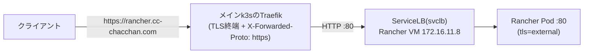

# rancher.yml — Rancher(Kubernetes管理サーバー)を構築する

Rancherを専用VMごと一気通貫で構築する。公式推奨に従い、Rancher管理サーバーはワークロードと同居させず**専用の単体k3sクラスタ**(server 1台・Traefik無効)に載せる。管理する側(このVM)と管理される側(メインクラスタ等)を分離し、循環依存を避ける構成。

k3s部分は `roles/vm_k3s` を**そのまま再利用**(変数だけRancher向けに指定)し、Rancher本体はHelm(`kubernetes.core.helm`・チャート版=本体版で固定)で導入する。Helmはメインクラスタの `roles/k8s`(helm template + SSA)とは別方式だが、あちらは接続先検証つきの `deploy.yml` 専用のため、別クラスタへ向けるこのロールはkubeconfig明示指定のHelm実行にしている。

## 公開経路(このリポジトリでの扱い)

TLSは**メインクラスタのTraefikで終端**し、VMの:80へHTTPで転送する(Coolify/Authentikと同じ `k8s_external_routes` 方式)。VM側はk3sのTraefikを無効化し、RancherのService(`type: LoadBalancer`)をk3s同梱の**ServiceLB(Klipper)**が:80へ直接束ねる。中間プロキシが無いため、X-Forwarded-Protoの信頼設定(Coolifyで必要だったtrustedIPs)も不要。



- 証明書: `rancher.cc-chacchan.com` は既存の `*.cc-chacchan.com` SANでカバー済み(Certificate変更不要)
- DNS: `rancher.cc-chacchan.com` → メインクラスタのTraefik(LAN側)のレコードを別途設定する
- Helm values(`roles/vm_rancher/tasks/install_rancher.yml`)は公式の外部TLS終端構成に合わせている:

| value | 値 | 理由 |
| --- | --- | --- |
| `tls` | `external` | Rancherは:80のHTTPで受け、X-Forwarded-Proto: httpsを信頼する。**cert-manager不要**(公式ドキュメントに明記)で、`ingress.tls.source` も参照されない |
| `agentTLSMode` | `system-store` | 既定の `strict`(CAピン留め)はLet's Encryptの中間CAローテーションで下流クラスタのエージェント接続が壊れる |
| `ingress.enabled` | `false` | このk3sはTraefik無効のためIngressコントローラが無い |
| `service.type` | `LoadBalancer` | ServiceLBがVMの:80へ直接公開する(NodePortだと経路表のポートが3xxxx番になり他サービスと不揃いになる) |
| `replicas` | `1` | シングルノードのため(既定の3はHA構成用) |

## 実行方法

```sh
# インベントリ実行(rancherグループの宣言どおり)
ansible-playbook playbooks/vm/rancher.yml

# 直接実行(インベントリ外に検証用をもう1台)
ansible-playbook playbooks/vm/rancher.yml \
  -e target=rancher02 -e profile=rancher -e vmid=1003 -e node=pve10 -e ip=172.16.11.108

# 経路の反映(メインクラスタのTraefikルート)
ansible-playbook playbooks/k8s/deploy.yml -e app=external
```

- 初期管理者パスワードは `vault/rancher.yml` の `vault_rancher_bootstrap_password`(構築時に自動生成済み。確認は `ansible-vault view vault/rancher.yml`)
- 初回ログイン: `https://rancher.cc-chacchan.com/` → ユーザー `admin` + 上記パスワード → 新しいパスワードへの変更とServer URL(そのまま確定でよい)を求められる

## 変数一覧

接続系の共通変数は [README.md](README.md#共通の変数)。全既定値の正は [roles/vm_rancher/defaults/main.yml](../../roles/vm_rancher/defaults/main.yml) と [inventory/group_vars/rancher.yml](../../inventory/group_vars/rancher.yml)。

| 変数 | 型 | 必須 | 既定値 | 説明 |
| --- | --- | :-: | --- | --- |
| `rancher_version` | str | | roles/vm_rancher/defaults | Helmチャート版=Rancher本体版 |
| `rancher_hostname` | str | | `rancher.{{ k8s_domain }}`(playbook) | 公開FQDN。Helm valuesの `hostname` |
| `rancher_bootstrap_password` | str | ✔ | vault | 初期管理者パスワード。playbookが `vault_rancher_bootstrap_password` から渡す。空だと実行前に止まる |
| `rancher_kubeconfig_path` | str | | `""` | 未指定ならVM上のkubeconfigを一時取得して使う |
| `kubernetes_version` / `kubernetes_disable` / `kubernetes_tls_san` | str / list / list | | group_vars/rancher.yml | k3s側の宣言(roles/vm_k3sの変数をそのまま使用) |

### バージョンの制約

- Rancherの版(`rancher_version`)と、このVMのk3sの版(`kubernetes_version`)は別々に固定する
- Rancher 2.14系のサポート上限はKubernetes **v1.35**。メインクラスタの版(v1.36系)はこのVMには使えない
- 同じ理由で、メインクラスタ(v1.36系)をdownstreamとしてimportするのは[サポートマトリクス](https://www.suse.com/suse-rancher/support-matrix/)の範囲外(動く可能性はあるが未認定)
- Rancherを上げるときはサポートマトリクスでk8s対応範囲を確認し、`rancher_version` と `kubernetes_version` を併せて更新してplaybookを再実行する

## 冪等性・更新

- k3sは版が一致すればインストールをスキップし、Rancher(Helm)は差分だけ収束する
- 更新は `rancher_version` と `kubernetes_version` を上げて再実行する

### kubeconfigの扱い

- VM上には `vm_k3s` が `~/.kube/config`(接続先はVMの実IPへ書き換え済み)を配置する
- Helm実行時はそれを**実行元の一時ファイルへ取得し、終了時に必ず削除**する(管理者権限そのもののため、リポジトリ内には置かない)
- 手元で常用したい場合: `scp -i ~/.ssh/id_ed25519_rancher rancher@172.16.11.8:.kube/config ~/.kube/config-rancher01`

## AWXでの実行

Job Template **`vm-rancher`**(定義: [awx/job_templates.yml](../../awx/job_templates.yml))。Surveyは共通セット。初期管理者パスワードはVault credentialで復号する `vault/rancher.yml` から渡るため、Surveyには出さない。

## つまずきやすいポイント

- **`https://rancher.cc-chacchan.com` に到達できない**: 経路の反映(`deploy.yml -e app=external`)とDNSレコードを確認。VM単体の生存確認は `curl http://172.16.11.8/healthz`(=ServiceLB→Podの経路。200なら外側の問題)
- **ログインループや「connection is not private」系**: Helm valuesの `tls=external` が効いているか(`helm -n cattle-system get values rancher`)。メインクラスタ側は `forwarded_https: true` がX-Forwarded-Proto: httpsを付ける
- **下流クラスタのエージェントが `strict CA verification` で失敗**: `agentTLSMode` が `system-store` になっているか確認(`kubectl get setting agent-tls-mode`)
- **Helmタスクの詳細が見たい**: `install_rancher.yml` はbootstrapPasswordを含むため `no_log` で全出力を抑止している。デバッグ時はVMへSSHし `kubectl -n cattle-system get pods` / `helm -n cattle-system status rancher` で確認する
