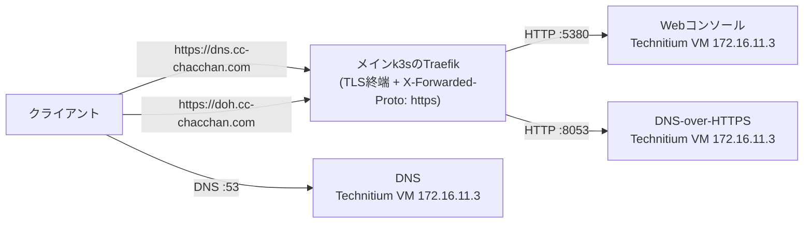

# technitium.yml — Technitium DNS(内部DNS)を構築する

Technitium DNSをVMごと一気通貫で構築する。DNS(:53)とWebコンソール(:5380)。ホスト側のstub resolverがポート53を塞いでいる場合は自動で退かせる。LAN内の名前解決(`*.cc-chacchan.com` の内部解決)を担うため、**停止すると影響が広い**。

## 公開経路(このリポジトリでの扱い)

Webコンソールと DNS-over-HTTPS のTLSは**メインクラスタのTraefikで終端**し、VMへHTTPで転送する。経路の宣言は [inventory/group_vars/all/k8s.yml](../../inventory/group_vars/all/k8s.yml) の `k8s_external_routes`(`technitium-dns`)。DNS本体(:53)はTraefikを通らず、クライアントがVMのIPへ直接問い合わせる。



- 公開範囲: どちらも `entrypoints` は `websecure` のみ = **LAN内限定**
- 証明書: `*.cc-chacchan.com` のワイルドカード(cert-manager)でカバーされる
- VM側の設定: `doh.` の転送先 :8053 はコンテナ側でDoHを有効化したうえで、VM側の公開ポートを `technitium_extra_ports` で宣言する

## 実行方法

```sh
# インベントリ実行(technitiumグループの宣言どおり)
ansible-playbook playbooks/vm/technitium.yml

# 直接実行(2台目を検証用に)
ansible-playbook playbooks/vm/technitium.yml \
  -e target=technitium-dns02 -e profile=technitium \
  -e vmid=605 -e node=pve06 -e ip=172.16.11.91
```

## 変数一覧

接続系の共通変数は [README.md](README.md#共通の変数)。全既定値の正は [roles/vm_technitium/defaults/main.yml](../../roles/vm_technitium/defaults/main.yml)。

| 変数 | 型 | 必須 | 既定値 | 説明 |
| --- | --- | :-: | --- | --- |
| `technitium_admin_password` | str | | 自動生成 | 管理者パスワード(初回生成・再実行で引き継ぐ) |
| `technitium_dns_port` | int | | `53` | DNSポート |
| `technitium_http_port` | int | | `5380` | Webコンソール |
| `technitium_recursion` | str | | `AllowOnlyForPrivateNetworks` | 再帰問い合わせの許可範囲 |
| `technitium_forwarders` | list | | `[]` | 上位DNS(例 `['1.1.1.1']`) |
| `technitium_enable_blocking` | bool | | `false` | 広告・トラッカーのブロック |

## AWXでの実行

Job Template **`vm-technitium`**(定義: [awx/job_templates.yml](../../awx/job_templates.yml))。Surveyは共通セット。

## つまずきやすいポイント

- **本番DNSへの再実行は影響範囲を意識する** → LAN内の名前解決を止めると広範囲に波及する。検証は2台目を直接実行で立てる
- **:53が使えないと起動しない** → playbookがsystemd-resolvedのstub listenerを自動で退かせるが、他のDNSソフトが居る場合は手動確認
- **管理者パスワードは初回起動時のみ反映** → 以降の変更はWebコンソールから
