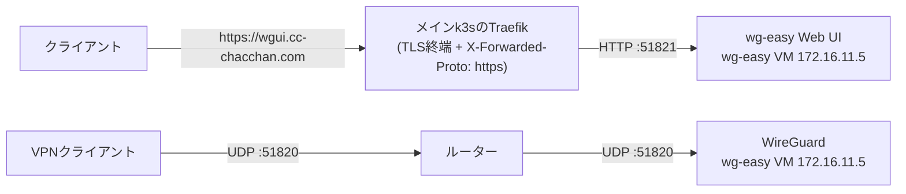

# wg-easy.yml — wg-easy(WireGuard VPN)を構築する

WireGuard VPN(wg-easy)をVMごと一気通貫で構築する。OIDC連携と初期パスワードは [vault/wg-easy.yml](../../vault/wg-easy.yml) から渡る。WireGuard本体はUDP :51820(ルーターで外部へ開けるのはこのポートだけ)、Web UIはTraefik経由の `https://wgui.<ドメイン>/` で使う。OIDCのリダイレクトURIなど、プロバイダ側に登録する値は実行結果に表示される。

## 公開経路(このリポジトリでの扱い)

Web UIのTLSは**メインクラスタのTraefikで終端**し、VMの:51821へHTTPで転送する。経路の宣言は [inventory/group_vars/all/k8s.yml](../../inventory/group_vars/all/k8s.yml) の `k8s_external_routes`(`wg-easy`)。WireGuard本体(UDP :51820)はTraefikを通らず、ルーターからVMへ直接転送する。



- 公開範囲: `entrypoints` は `websecure` のみ = **LAN内限定**(WireGuard接続中の端末を含む)
- 証明書: `*.cc-chacchan.com` のワイルドカード(cert-manager)でカバーされる
- VM側の設定: 役割プロファイルで `wg_easy_insecure: false`(環境変数 `INSECURE`)にしているため、ログインはHTTPSの入口(`wgui.`)からのみ。`http://<IP>:51821/` では直接ログインできない

## 実行方法

```sh
# インベントリ実行(wg_easyグループの宣言どおり)
ansible-playbook playbooks/vm/wg-easy.yml

# 直接実行(設定を変えて2台目を検証)
ansible-playbook playbooks/vm/wg-easy.yml \
  -e target=wg-easy02 -e profile=wg_easy \
  -e vmid=506 -e node=pve05 -e ip=172.16.11.32 \
  -e wg_easy_init_host=vpn2.cc-chacchan.com -e wg_easy_wg_port=51822
```

## 変数一覧

接続系の共通変数は [README.md](README.md#共通の変数)。全既定値の正は [roles/vm_wg_easy/defaults/main.yml](../../roles/vm_wg_easy/defaults/main.yml)(OAuthプロバイダ別の設定はそちらを参照)。

| 変数 | 型 | 必須 | 既定値 | 説明 |
| --- | --- | :-: | --- | --- |
| `wg_easy_init_host` | str | ✔ | 役割プロファイル | クライアントが接続するFQDN/IP |
| `wg_easy_version` | str | | `15.4.0` | イメージの版(OAuth対応の要件あり) |
| `wg_easy_wg_port` | int | | `51820` | WireGuardのUDPポート |
| `wg_easy_ui_port` | int | | `51821` | Web UIポート |
| `wg_easy_init_password` | str | | vault / 自動生成 | 初期管理者パスワード |
| `wg_easy_oauth_providers` | str | | `oidc` | SSOプロバイダ(`oidc` / `google` / `github`) |
| `wg_easy_oauth_oidc_server` | str | | 役割プロファイル | OIDCサーバーURL(Authentik) |
| `wg_easy_oauth_oidc_client_id` / `_secret` | str | | vault | OIDCクライアント認証情報 |

## AWXでの実行

Job Template **`vm-wg-easy`**(定義: [awx/job_templates.yml](../../awx/job_templates.yml))。Surveyは共通セット。

## つまずきやすいポイント

- **外部公開はUDP :51820だけ** → UIはインターネットへ公開しない。ルーターのポート開放を確認
- **`http://<IP>:51821/` でログインできない** → `wg_easy_insecure: false` の仕様。`https://wgui.cc-chacchan.com/` から開く
- **OIDC連携が失敗する** → プロバイダ(Authentik)側にリダイレクトURIの登録が必要。値は実行結果に表示される
- **初期パスワードでログインできない** → `wg_easy_init_*` はセットアップウィザードのスキップ用で、**初回起動時のみ**反映される
