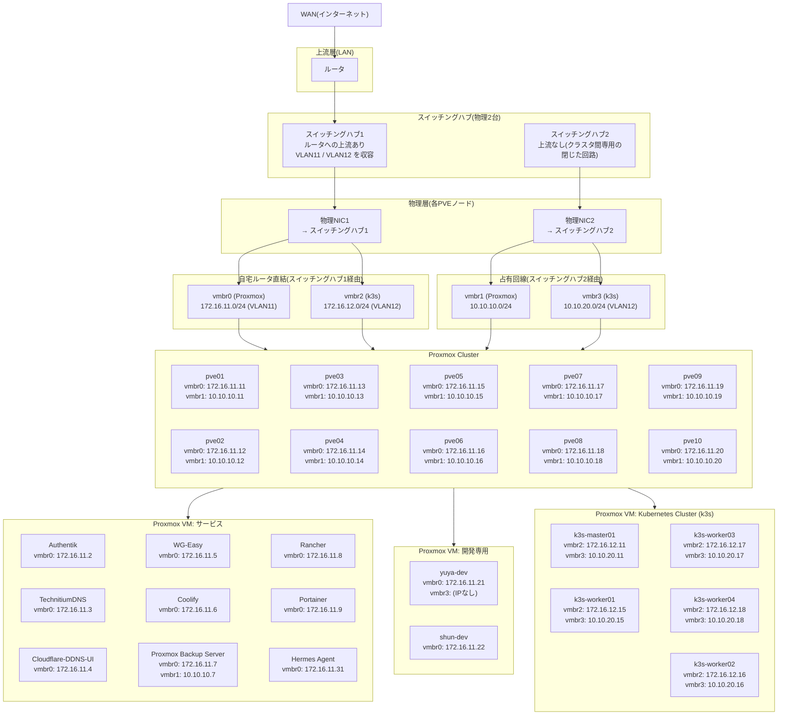
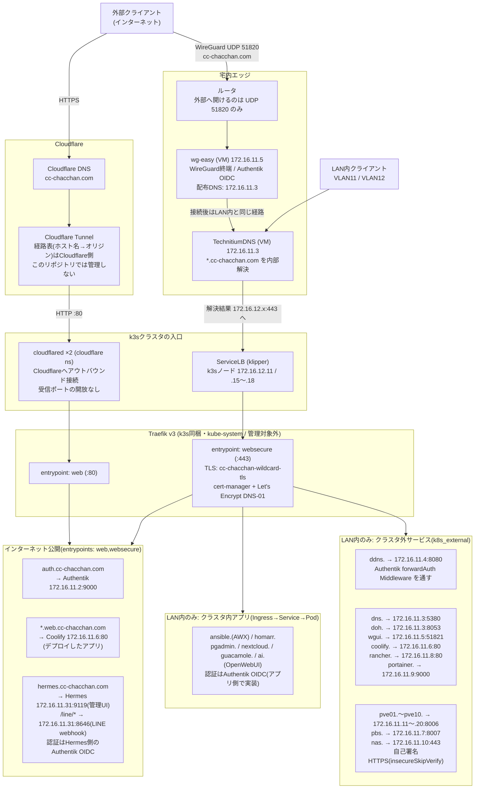

# インフラストラクチャ

## ネットワーク

- 各PVEノードの物理NIC 2枚は、**別々のスイッチングハブ**に挿さっている。NIC1側のハブだけがルータへ上がり、NIC2側のハブは上流を持たないクラスタ間専用の閉じた回路
- したがって外部と通信できるのは NIC1 が収容する `vmbr0` / `vmbr2`(ともに自宅ルータ直結・VLANタグ付き)だけ。`vmbr1` / `vmbr3` はクラスタ内部専用で、デフォルトゲートウェイを持たない
- k3s APIサーバー(`k8s_api_server: https://10.10.20.11:6443`)やPBSのバックアップ転送は、この占有回線側を通る

## 公開経路(Traefik)

すべてのHTTP(S)公開はk3s同梱のTraefik v3に集約される。**インターネットへ出るのはCloudflare Tunnel経由のホスト(auth. / *.web. / hermes.)だけ**で、残りはLAN内(WireGuard接続中の端末を含む)からのみ到達できる。

### 公開範囲の決めかた

- 公開範囲は Ingress の `traefik.ingress.kubernetes.io/router.entrypoints` で決まる。既定は `websecure` のみ = **LAN内限定**。`web,websecure` を明示したホスト名だけが、HTTP :80 で入ってくるCloudflare Tunnelから到達できる
- ルータで外部へ開けているのは WireGuard の UDP 51820 だけ。HTTP/HTTPS の受信ポートは開けていない(公開はすべて cloudflared のアウトバウンド接続経由)
- Cloudflare Tunnel の経路表はCloudflare側にあり、`roles/k8s_cloudflared` はコネクタ(Deployment/PDB)だけを収束させる。**公開ホストを増やす操作はこのリポジトリでは完結しない**
- クラスタ外サービスの単一の真実は `inventory/group_vars/all/k8s.yml` の `k8s_external_routes`。1エントリからService(セレクタなし)+EndpointSlice+Ingress+Middlewareが生成される
- WireGuardクライアントには `172.16.11.3`(TechnitiumDNS)が配布されるため、VPN接続中は LAN内クライアントとまったく同じ名前解決・同じ経路になる
